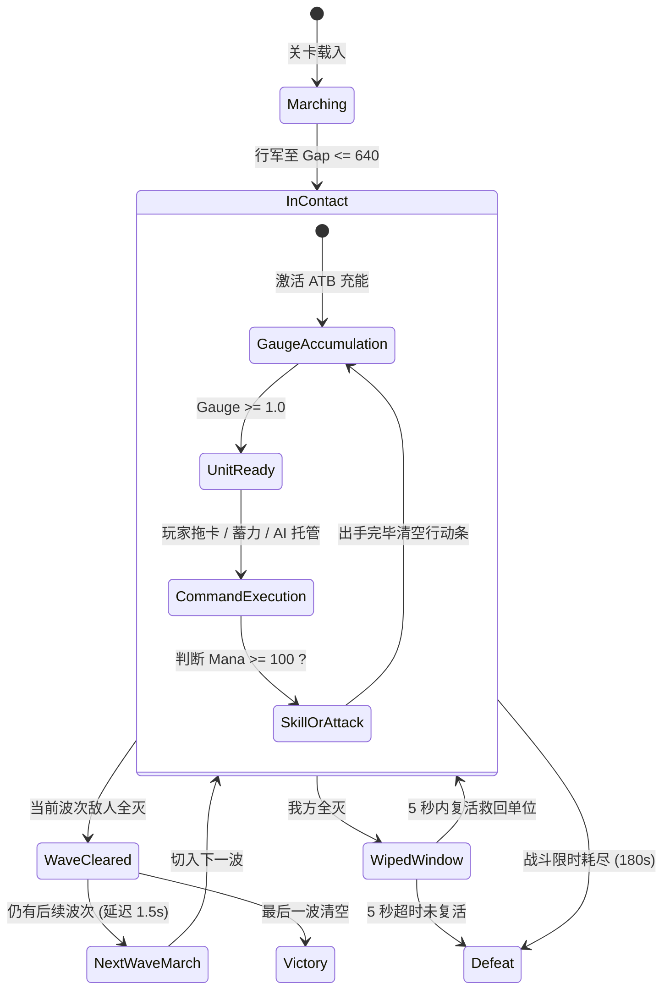

# 战斗系统核心机制文档

> **文档定位**：《单机三国志2 重制版》的**纯战斗规则集**，不含引擎架构、美术资源与战后养成内容。目标是"照此文档可独立实现一个行为一致的战斗内核"。
> **适用范围**：战斗内核实现、数值调优、AI 托管逻辑、无头自动化测试。
> **关联文档**：[BATTLE_SYSTEM.md](BATTLE_SYSTEM.md)（架构分层、表现层与资源映射）

### 标注约定

| 标记 | 含义 |
|---|---|
| *（无标记）* | 源自原始设计文档，为既定规则 |
| **[补全]** | 原文档未定义、实现时必须决策的行为。本版给出默认口径，**可调整，但必须有一个明确答案** |
| **[推导]** | 由既有规则计算得出的参考数据，非独立规则 |

---

## 目录

**A. 基础模型**
1. [机制总览](#一机制总览)
2. [术语与符号](#二术语与符号)
3. [单位属性模型](#三单位属性模型)
4. [战场空间与阵型规则](#四战场空间与阵型规则)

**B. 时间与流程**

5. [战斗生命周期](#五战斗生命周期)
6. [主循环与固定步长](#六主循环与固定步长)
7. [行动条（ATB）](#七行动条atb)

**C. 出手与结算**

8. [资源系统：法力与怒气](#八资源系统法力与怒气)
9. [指令下发与出手形态](#九指令下发与出手形态)
10. [目标选取规则](#十目标选取规则)
11. [单次出手完整结算管线](#十一单次出手完整结算管线)
12. [数值与公式](#十二数值与公式)
13. [职业天赋体系](#十三职业天赋体系)
14. [状态效果体系](#十四状态效果体系)

**D. 系统层**

15. [AI 托管行为](#十五ai-托管行为)
16. [波次推进与战斗间复活](#十六波次推进与战斗间复活)
17. [胜负判定](#十七胜负判定)
18. [确定性与随机数](#十八确定性与随机数)
19. [事件流接口](#十九事件流接口)
20. [常量速查表](#二十常量速查表)

**附录**

- [附录 A：本版补全的规格决策清单](#附录-a本版补全的规格决策清单)
- [附录 B：已知设计风险与待决策项](#附录-b已知设计风险与待决策项)

---

# A. 基础模型

## 一、机制总览

战斗为**实时推进制**，而非严格交替的回合制。核心循环由三条规则咬合而成：

1. **行动条驱动出手顺序**——每个单位按自身速度实时充能行动条，充满即可出手；
2. **法力决定出手形态**——出手时法力满槽则释放战法技能，否则打出普通攻击；
3. **玩家介入靠拖拽下令**——就绪单位可由玩家拖卡指定目标，超时则由 AI 托管。

在此之上叠加三层深度：**六职业差异化天赋**、**五行相生相克**、**多波次连战 + 战斗间复活**。

所有战斗计算为**确定性纯逻辑**，不依赖渲染帧率与表现层，支持无头模式下的极速模拟与单元测试（单场战斗数毫秒内完成）。确定性的具体保障见 [第十八节](#十八确定性与随机数)。

---

## 二、术语与符号

| 符号 / 术语 | 含义 |
|---|---|
| `Gauge` | 行动条，取值 `[0, 1]`，达到 `1.0` 即就绪（Ready） |
| `Mana` | 法力，取值 `[0, 100]`，满槽触发战法技能 |
| `Rage` | 怒气，取值 `[0, 100]`，**当前版本仅积累不消耗**（见 [8.3](#83-怒气rage)） |
| `Atk` / `Armor` / `Speed` | 攻击力 / 护甲 / 速度（敏捷） |
| `HpRatio` | 当前生命 ÷ 最大生命 |
| `Elem` | 五行克制系数，取 `1.25 / 1.00 / 0.75` |
| `TalentAtk` | 职业天赋攻击乘区（`TalentAtkMultiplier`） |
| `TalentDR` | 职业天赋受伤乘区（`TalentDamageTakenMultiplier`） |
| `SkillMult` | 技能配置表中的伤害/治疗倍率 |
| `Charge` | 蓄力乘区，取 `1.5`（术系蓄力成功）或 `1.0` |
| `SlowFactor` | 减速系数，钳制于 `[0.2, 1.0]` |
| **就绪（Ready）** | `Gauge >= 1.0` 且未被眩晕/冰冻 |
| **出手（Action）** | 一次完整的普攻或技能释放，正常消耗满行动条 |
| **额外再动（ExtraAction）** | 速系天赋触发的追加出手，**不产生资源** |
| **直接攻击伤害** | 由普攻或技能造成的伤害。**不含** DOT 跳伤 |

---

## 三、单位属性模型

**[补全]** 每个战场单位（`BattleUnit`）持有以下字段。无此模型无法对齐内核与配置表。

### 3.1 静态属性（战斗开始时由配置表装载，战中不变）

| 字段 | 类型 | 说明 |
|---|---|---|
| `UnitId` | `int` | 战场内唯一自增 ID，**同时作为一切排序的最终 tie-break 键** |
| `Side` | `enum{Player, Enemy}` | 阵营 |
| `Class` | `enum{Fang, Jin, Su, Yuan, Fa, Liao}` | 职业，决定天赋 |
| `Element` | `enum{None, Jin, Mu, Shui, Huo, Tu}` | 五行属性，来自符石镶嵌 / 怪物表 |
| `Weapon` | `string` | 武器标签，仅驱动表现层特效，**不参与任何逻辑计算** |
| `MaxHp` | `int` | 最大生命 |
| `Atk` | `int` | 攻击力，**同时作为治疗力**（见 [12.4](#124-治疗公式)） |
| `Armor` | `int` | 护甲 |
| `Speed` | `int` | 速度，决定行动条充能速率 |
| `MoveSpeed` | `float` | 行军移速（我方 `900`，敌方 `800`） |
| `ActiveSkill` | `SkillDef?` | 战法技能，可为空（空则永远只普攻） |

### 3.2 动态状态（战中变化）

| 字段 | 初值 | 说明 |
|---|---|---|
| `Hp` | `MaxHp` | 当前生命，`<= 0` 判定阵亡 |
| `Mana` | `0` **[补全]** | 当前法力 |
| `Rage` | `0` **[补全]** | 当前怒气 |
| `Gauge` | `0` | 当前行动条 |
| `ReadyElapsed` | `0` | 就绪后已等待时长，用于 AI 托管超时判定 **[补全]** |
| `IsExtraAction` | `false` | 本次出手是否为速系额外再动 **[补全]** |
| `PendingCommand` | `null` | 玩家已下达但未结算的指令 **[补全]** |
| `Row` / `Column` | 布阵值 | 排（0=前排, 1=后排）/ 列（0–4） |
| `Position` | `StartLine` | 战场坐标，行军阶段推进 |
| `Alive` | `true` | 存活标记 |
| `Statuses` | `[]` | 状态效果列表，见 [14.1](#141-状态实例结构) |

### 3.3 派生量（每次读取时实时计算，不缓存）

```
HpRatio      = Hp / MaxHp
SlowFactor   = clamp(Π(1 - Slow_i.Magnitude), 0.2, 1.0)     // [补全] 乘法叠加
TalentAtk    = 见第十三节
TalentDR     = 见第十三节
IsReady      = Gauge >= 1.0 && !HasStatus(Stun) && !HasStatus(Freeze)
CanCastSkill = Mana >= 100 && !HasStatus(Silence) && ActiveSkill != null
```

---

## 四、战场空间与阵型规则

战场为纵向大纵深布局，双方各持 `2 排 × 5 列 = 10 格阵位`。

```
           【敌方后排 (Slot 5-9)】  y = +760
           【敌方前排 (Slot 0-4)】  y = +280   (EnemyFrontLine)
===================== 接敌对峙线 Gap = 640 =====================
           【我方前排 (Slot 0-4)】  y = -360   (PlayerFrontLine)
           【我方后排 (Slot 5-9)】  y = -840
```

### 4.1 站位参数

| 参数项 | 标识 | 数值 | 说明 |
|---|---|---|---|
| 我方前排基准线 | `PlayerFrontLine` | `-360f` | 锚点 `y = -600` + 前排偏移 `+240` |
| 敌方前排基准线 | `EnemyFrontLine` | `+280f` | 锚点 `y = +280` + 前排偏移 `0` |
| 接敌安全空隙 | `ContactGap` | `640f` | 接敌判定距离，防止双方卡牌重叠 |
| 前后排间距 | `RowSpacing` | `480f` | 前排 `+240` / 后排 `-240` |
| 列间距（X 轴） | `ColumnSpacing` | `160f` | 固定 5 槽：`x = -320, -160, 0, +160, +320` |
| 起始行军线 | `StartLine` | `±1250f` | 开局屏幕外初始纵坐标 |

### 4.2 布阵铁律

- **卡牌天然层叠**：单卡本体宽 `266px`（预制体 `280 × 0.95`），列间距 `160px`，同排相邻卡牌必然重叠 `106px`；
- **不占相邻列**：同一排最多上阵 **3 人**，且**不得占用相邻列**。

**[推导]** 该约束下的合法解：

| 该排人数 | 合法列组合 | 组合数 |
|:---:|---|:---:|
| 3 | `{0,2,4}` | **1（唯一解）** |
| 2 | `{0,2} {0,3} {0,4} {1,3} {1,4} {2,4}` | 6 |
| 1 | 任意单列 | 5 |

> ⚠ 三人排只有唯一合法解，意味着该排没有任何布阵决策空间。此约束的成因是渲染遮挡而非玩法设计，见 [附录 B-4](#b-4-阵型决策空间坍缩)。

### 4.3 队伍规模 **[补全]**

原文档中"10 格阵位"、"单排 ≤3 人"、"星级按 5 人"三个数字互相矛盾。本版统一为：

| 概念 | 数值 | 说明 |
|---|:---:|---|
| 阵位容器 | 10 格 | 数据结构上限，非上阵上限 |
| 单边上阵理论上限 | **6 人** | 由 `单排 ≤3 × 2 排` 推出 |
| **我方出战队伍** | **固定 5 人** | 星级评定以此为基准；布阵为 `前3后2` 或 `前2后3` |
| 敌方波次单边人数 | **1 ~ 6 人** | 由波次配置表决定，可用满 6 格 |

---

# B. 时间与流程

## 五、战斗生命周期



### 5.1 行军阶段（Marching）

- 双方开局位于 `y = ±1250f` 的屏幕外；
- 先锋单位以 `MoveSpeed` 对向推进（我方 `900px/s`，敌方 `800px/s`）；
- **行军期间行动条锁定为 0**，不得普攻或释放技能；
- **[补全]** 行军期间**不推进状态计时、不结算 DOT**，战斗计时器**照常累加**；
- **[补全]** 先到位的一方原地等待，**不获得任何先手收益**。

### 5.2 接敌阶段（Contact）

- 双方前排间距缩小至 `ContactGap <= 640f` 时判定正式接敌；
- 移速归零，锁定于阵线坐标（`-360f` / `+280f`）；
- **全体单位解锁行动条累加，进入 ATB 循环**。

**[推导]** 行军耗时参考：我方 `(1250-360)/900 ≈ 0.99s`，敌方 `(1250-280)/800 ≈ 1.21s`。接敌时点由较慢一方决定，约 `1.21s`。

### 5.3 战斗限时

单场战斗上限 **180 秒**，超时未通关直接判负。复活成功后战斗计时器**复位归零**。

---

## 六、主循环与固定步长

### 6.1 固定步长要求 **[补全]**

`BattleSim` **必须以固定步长推进**，不得直接消费渲染层的可变 `delta`，否则确定性承诺失效（相同输入在不同帧率下产生不同结果）。

```
FixedDeltaTime = 1/60f   // 16.667ms

// 表现层：累积时间，调用整数次 Step
accumulator += frameDelta
while (accumulator >= FixedDeltaTime) {
    sim.Step(FixedDeltaTime)
    accumulator -= FixedDeltaTime
}
// 单帧内最多连续 Step 5 次，防止卡顿后的追帧雪崩
```

### 6.2 每步执行顺序

**顺序不可调换**——它决定了同一 tick 内"DOT 致死"与"该单位出手"的优先级等边界行为。

```
Step(dt):
    ── Phase == Marching ────────────────────────────────
    1. 推进双方队列位置
    2. if 前排间距 <= ContactGap: Phase = InContact; Emit(Contact)
    3. BattleTimer += dt
    return

    ── Phase == InContact ───────────────────────────────
    1. 状态计时推进（遍历全体存活单位，UnitId 升序）
       for s in u.Statuses:
           s.Duration -= dt
           if s.IsDot:
               s.NextTickAt -= dt
               while s.NextTickAt <= 0:
                   结算一跳 DOT（见 12.5）
                   s.NextTickAt += s.TickInterval
           if s.Duration <= 0: 移除并 Emit(StatusExpire)
       // [补全] DOT 可致死；本步死亡的单位不再参与后续所有阶段

    2. 行动条推进（遍历全体存活单位，UnitId 升序）
       if HasStatus(Stun) || HasStatus(Freeze): continue    // 冻结，不累加
       prev = Gauge
       Gauge = min(1.0, Gauge + Speed * SlowFactor * 0.005 * dt)
       if prev < 1.0 && Gauge >= 1.0: ReadyElapsed = 0; Emit(GaugeFull)
       if Gauge >= 1.0: ReadyElapsed += dt

    3. 指令服务（构造就绪队列后遍历）
       ready = 存活 && IsReady 的单位
              .OrderByDescending(Gauge)          // [补全] 排序键
              .ThenBy(UnitId)                    // [补全] tie-break
       for u in ready:
           if !u.Alive: continue                 // 可能已在本轮被击杀
           if u.Side == Player && u.PendingCommand == null
              && u.ReadyElapsed < AutoCommandDelay: continue   // 等待玩家
           if u 正被玩家按住（蓄力中）: continue               // 无限期挂起
           ExecuteAction(u)                      // 见第十一节

    4. 波次 / 胜负判定
       if 敌方全灭: Phase = WaveCleared; WaveTimer = 1.5f
       if 我方全灭: Phase = WipedWindow;  ReviveTimer = 5.0f
       BattleTimer += dt
       if BattleTimer > 180f: Phase = Defeat
```

**关键边界行为 [补全]**：

- 同一 tick 内，**状态计时先于行动条推进**——因此 DOT 造成的死亡会阻止该单位本 tick 出手；
- 减速状态在本 tick 内**先衰减、后影响充能**——若减速恰在本 tick 到期，本 tick 已按未减速速率充能；
- 就绪队列在阶段 3 开始时**一次性构造**，遍历过程中新就绪的单位等到下一 tick 处理（避免同 tick 内的连锁不确定性）。

---

## 七、行动条（ATB）

### 7.1 充能公式

$$\Delta \text{Gauge} = \text{Speed} \times \text{SlowFactor} \times \text{GaugePerSpeedUnit} \times \Delta t$$

- $\text{GaugePerSpeedUnit} = 0.005$ —— 速度 200 的单位 1 秒充满一条；
- $\text{SlowFactor} \in [0.2,\ 1.0]$，多层减速**乘法叠加** **[补全]**：$\text{SlowFactor} = \text{clamp}\left(\prod_i (1 - m_i),\ 0.2,\ 1.0\right)$；
- **眩晕 / 冰冻期间行动条完全静止**，且**已积累值不清空**——解控后立即就绪 **[补全]**；
- 行动条**封顶于 1.0，溢出丢弃** **[补全]**。

### 7.2 速度—节奏对照表 **[推导]**

$$\text{出手周期} = \frac{1}{\text{Speed} \times 0.005} = \frac{200}{\text{Speed}}\ \text{秒}$$

| Speed | 出手周期 | 60s 内出手次数 | 备注 |
|---:|---:|---:|---|
| 80 | 2.50s | 24 | |
| 100 | 2.00s | 30 | |
| **125** | **1.60s** | 37.5 | **术系蓄力盈亏平衡点**（见 [附录 B-2](#b-2-术系蓄力的-dps-收支)） |
| 150 | 1.33s | 45 | |
| 200 | 1.00s | 60 | 基准 |
| 250 | 0.80s | 75 | |
| 300 | 0.67s | 90 | |

### 7.3 出手队列展示

战场侧栏常驻 **5 个出手预览槽**（`178 × 124` 像素），排序优先级：

1. **已就绪（`IsReady`）单位置顶**；
2. 未就绪单位按 `Gauge` **降序**排列，卡面压暗并显示充能百分比；
3. **[补全]** 队列**只展示我方单位**（因其唯一用途是拖拽下令）。我方固定 5 人，故槽位与队伍等量，队列信息价值在于**顺序**而非"谁上榜"。

---

# C. 出手与结算

## 八、资源系统：法力与怒气

### 8.1 法力（Mana）

| 规则 | 值 | 来源 |
|---|---|---|
| 取值范围 | `[0, 100]` **[补全]** | 上限 100，**溢出部分丢弃** |
| 战斗开始初值 | `0` **[补全]** | |
| 普攻回复 | `+30` | |
| 技能消耗 | 归零（`Mana = 0`） | |
| 受击退火 | `-10` | 见 [8.2](#82-受击法力退火) |
| 额外再动 | **不回复** | 速系天赋约束 |
| 跨波次 | **保留** **[补全]** | 连续战斗，法力不重置 |

**[推导]** 技能释放节奏：`0 → 30 → 60 → 90 → 100(封顶)`，即**满血环境下每 4 次普攻后第 5 次出手放技能**，技能占比 20%。速度 200 时首次技能在第 **4 秒**。

> ⚠ 若波次平均清场时间短于 4 秒，将有大量单位全程无法释放技能。必须用无头模拟验证"人均技能释放次数"，见 [附录 B-7](#b-7-技能系统可能形同虚设)。

### 8.2 受击法力退火

- **非补系**单位受到**直接攻击伤害**时，法力强制回退 10 点：`Mana = max(0, Mana - 10)`；
- **[补全]** 退火触发条件的精确边界：

| 伤害来源 | 是否触发退火 |
|---|:---:|
| 普通攻击 | ✅ |
| 技能直接伤害（含 AOE，**每个被命中目标各触发一次**） | ✅ |
| DOT 跳伤（火烧 / 中毒 / 流血） | ❌ |
| 伤害被完全减免至保底 1 点 | ✅ |
| 该次伤害导致目标阵亡 | ❌（已死亡，无意义） |

- **补系（`Liao`）完全免疫退火**。

**[推导]** 断蓝阈值——单位速度 `S`，被 `n` 个速度 `Se` 的敌人持续攻击时：

$$\text{法力净收入} \ge 0 \iff 0.15S \ge 0.05 \cdot n \cdot Se \iff n \le \frac{3S}{Se}$$

**同速情况下，只要有 4 个及以上敌人攻击同一单位，该单位法力永远停在 0。** 这对前排防系影响最大，见 [附录 B-3](#b-3-前排坦克断蓝)。

### 8.3 怒气（Rage）

| 规则 | 值 |
|---|---|
| 取值范围 | `[0, 100]` **[补全]** |
| 战斗开始初值 | `0` **[补全]** |
| 普攻回复 | `+10` |
| 技能回复 | `+20` |
| 额外再动 | **不回复** |
| 跨波次 | **保留** **[补全]** |
| **消耗端** | **⚠ 当前版本无任何消耗机制** |

> ⚠ 怒气是一个**只进不出的悬空资源**。当前实现应保留字段与积累逻辑（作为后续合击/必杀系统的预留接口），但**不应在 UI 上向玩家展示**，否则构成功能承诺落空。见 [附录 B-5](#b-5-怒气系统悬空)。

---

## 九、指令下发与出手形态

### 9.1 三种指令来源

| 来源 | 触发 | 说明 |
|---|---|---|
| **玩家拖拽** | 按住已就绪的队列卡片 → 拖至目标 → 松手 | 生成 `PendingCommand{Target, ChargeHeld}` |
| **玩家蓄力** | 同上，但按住时长 `>= 0.8s`（仅术系生效） | `Charge = 1.5` |
| **AI 托管** | 就绪后 `ReadyElapsed >= AutoCommandDelay` 仍无玩家输入 | 见 [第十五节](#十五ai-托管行为) |

### 9.2 实时性与托管窗口 **[补全]**

原文档未定义拖拽期间的时间处理，本版口径：

- **拖拽期间时间不暂停**——战斗持续实时推进，符合"实时推进制"的基本定位；
- **`AutoCommandDelay = 0.6s`**：单位就绪后进入 0.6 秒的等待窗口，期间不自动出手，留给玩家操作；超时则交由 AI 托管；
- **玩家一旦按住某单位的卡片，该单位无限期挂起**，不再自动出手，直至松手（下达指令）或取消拖拽（回到等待窗口计时，从当前 `ReadyElapsed` 继续）；
- 等待窗口对双方**对称生效**（敌方 AI 亦有 0.6s 延迟），保证 `AutoCommandDelay` 是纯粹的节奏旋钮而非平衡参数。

> `AutoCommandDelay` 是**全局节奏的主调节旋钮**。调大 → 战斗变慢、玩家操作从容；调小 → 战斗紧凑、手操压力上升。0.6 是起始值，需实测调校。见 [附录 B-1](#b-1-手操带宽超载)。

### 9.3 出手形态判定

```
CanCastSkill = Mana >= 100 && !HasStatus(Silence) && ActiveSkill != null
```

| 形态 | 条件 | 效果 |
|---|---|---|
| **战法技能** | `CanCastSkill == true` | 按技能配置结算；`Mana → 0`；`Rage +20` |
| **普通攻击** | 其余全部情况 | `1.0 × Atk` 物理伤害；`Mana +30`；`Rage +10` |

**[补全]** 沉默的确切效果：沉默下单位**继续普攻并继续回蓝**，法力封顶 100。沉默结束后的下一次出手立即释放技能。**因此沉默是"延迟"而非"剥夺"**，其真实价值是把该单位在持续时间内压制为纯普攻单位。

### 9.4 蓄力机制（Charge）

- **职业专享**：仅术系（`Fa`）生效，其余职业按住无任何效果；
- **触发条件**：按住就绪卡片 `>= 0.8s` 后拖入敌方阵地松手；
- **增幅**：`Charge = 1.5`，作用于**伤害倍率、百分比斩杀、治疗量**；
- **[补全]** 按住期间**行动条不继续累积**（已封顶于 1.0），出手时点被实际延后；
- **[补全]** 敌方 AI **不使用蓄力**——这是玩家侧的手操红利，也是"手操与自律的分水岭"的兑现方式。

> ⚠ 在"按住不累积行动条"的口径下，蓄力对速度 > 125 的术系单位是 **DPS 负收益**。这是当前体系最需要复核的一处，见 [附录 B-2](#b-2-术系蓄力的-dps-收支)。

---

## 十、目标选取规则

技能从配置表解析 `TargetMode`，据此自动寻敌。

| TargetMode | 阵营 | 选取规则 |
|---|:---:|---|
| `Single` | 敌 | 优先使用拖拽选定目标；无选定时按 [10.1](#101-默认单体目标规则) 回退 |
| `FrontRow` | 敌 | 敌方前排全部存活单位 |
| `BackRow` | 敌 | 敌方后排全部存活单位 |
| `MiddleColumn` | 敌 | 位于中间列（`Column == 2`）的全部存活敌人 |
| `AllEnemies` | 敌 | 敌方全体存活单位 |
| `RandomN` | 敌 | 从存活敌人中随机抽取 N 个 |
| `LowestHpAlly` | 友 | 我方 `HpRatio` 最低的存活单位 |
| `AllAllies` | 友 | 我方全体存活单位 |

### 10.1 默认单体目标规则 **[补全]**

原文档的"敌方前排最前单位"在同排 y 坐标相同的前提下无法确定。本版定义为**距离最近优先**：

```
1. 优先前排（Row == 0）存活单位；前排全灭则取后排
2. 同排内按与攻击者的 |Column 差| 升序
3. 完全并列时按 UnitId 升序
```

该规则使攻击者天然优先打击**正对面的同列单位**，避免全体敌人无脑集火同一个前排单位。

### 10.2 通用选取约束 **[补全]**

- **所有模式一律过滤已阵亡单位**；
- 若筛选结果为空，则**放弃本次出手，但仍清空行动条并结算资源收支**（避免无目标时的空转死循环）；
- `RandomN`：**不重复选取**同一目标；存活数 `< N` 时取全部存活单位；抽样使用 Fisher–Yates 部分洗牌，保证确定性；
- `LowestHpAlly`：按 `HpRatio` 升序，并列时取 `UnitId` 最小者；**不能选中已阵亡单位**（治疗无法复活）。

### 10.3 玩家拖拽的目标合法性 **[补全]**

原文档只描述了"拖曳至敌方单位"，导致补系无法手动指挥。本版扩展：

| 技能 TargetMode 阵营 | 合法拖拽落点 |
|---|---|
| 敌方类（`Single` / `FrontRow` / `BackRow` / `MiddleColumn` / `AllEnemies` / `RandomN`） | 敌方单位或敌方阵地区域 |
| 友方类（`LowestHpAlly` / `AllAllies`） | **我方单位或我方阵地区域** |

- 对非 `Single` 的群体模式，拖拽落点**只用于确认出手，不改变目标集合**；
- 拖至非法区域松手 = **取消指令**，单位回到等待窗口继续计时。

---

## 十一、单次出手完整结算管线

这是整个内核最关键的一节——**结算顺序决定了大量边界行为**。

### 11.1 出手主流程

```
ExecuteAction(u):
    isExtra = u.IsExtraAction;  u.IsExtraAction = false
    cmd     = u.PendingCommand ?? AiDecide(u)
    u.PendingCommand = null

    ── 1. 形态判定 ─────────────────────────────
    useSkill = u.Mana >= 100 && !u.HasStatus(Silence) && u.ActiveSkill != null

    ── 2. 蓄力判定 ─────────────────────────────
    charge = (u.Class == Fa && useSkill && cmd.ChargeHeld >= 0.8f) ? 1.5f : 1.0f

    ── 3. 目标解析 ─────────────────────────────
    mode    = useSkill ? u.ActiveSkill.TargetMode : Single
    targets = ResolveTargets(u, mode, cmd.Target)
    if targets.IsEmpty: goto 6                      // 空目标：空过但仍结算资源

    ── 4. 逐目标结算（targets 按 UnitId 升序遍历）──
    for t in targets:
        if !t.Alive: continue                       // 前序目标的连锁效果可能已击杀
        if 效果为治疗: ApplyHeal(u, t, ...)
        else:          ApplyDamage(u, t, ...)       // 见 11.2

    ── 5. 施法者附加天赋 ───────────────────────
    if !useSkill && u.Class == Yuan:
        for t in targets where t.Alive:
            if Rng.NextFloat() < 0.25: ApplyStatus(t, Bleed, from: u)

    ── 6. 资源结算 ─────────────────────────────
    if useSkill:
        u.Mana = 0                                  // 消耗，无论是否 extra
        if !isExtra: u.Rage = min(100, u.Rage + 20)
    else:
        if !isExtra:
            u.Mana = min(100, u.Mana + 30)
            u.Rage = min(100, u.Rage + 10)

    ── 7. 速系再动判定 ─────────────────────────
    if u.Class == Su && u.Alive && Rng.NextFloat() < 0.30:
        u.Gauge = 1.0
        u.IsExtraAction = true                      // 可连锁，见下
        u.ReadyElapsed  = 0
        Emit(ExtraAction, u)
    else:
        u.Gauge = 0
```

**[补全]** 关键裁定：

| 情形 | 裁定 |
|---|---|
| 额外再动能否释放技能 | **能**。`isExtra` 只屏蔽资源**产出**，不屏蔽消耗与行为 |
| 额外再动能否再次触发再动 | **能，可无限连锁**。期望出手 `1/(1-0.3) = 1.43` 次 |
| 额外再动是否需要玩家指令 | **否**，直接沿用 AI 托管（`ReadyElapsed` 重置但玩家通常来不及响应） |
| 弓系流血在技能出手时是否触发 | **否**，仅普攻触发（原文："普攻命中有 25% 概率"） |
| 目标在遍历中途死亡 | 跳过，不结算，不消耗额外资源 |
| 无合法目标 | 空过，但**照常清空行动条并结算资源**（第 6、7 步仍执行） |

**[推导]** 速系"不产能"的真实效果：技能释放速率 = `(Speed/200) / 5` 次/秒，**与同速非速系单位完全相同**。速系的 `+43%` 出手**全部加在普攻上，技能次数零增益**。若普攻占总伤害比例为 `f`，速系实际 DPS 增幅 = `0.43 × f`（`f = 0.4` 时约 `+17%`）。这是一条设计得相当克制的天赋。

### 11.2 单目标伤害结算

```
ApplyDamage(src, tgt, skillMult, charge, isAbsolute, statusesToApply):

    ── 1. 攻击侧乘区 ───────────────────────────
    elem = ElementCoef(src.Element, tgt.Element)          // 1.25 / 1.00 / 0.75
    raw  = src.Atk * src.TalentAtk * skillMult * charge * elem

    ── 2. 防御减免 ─────────────────────────────
    if isAbsolute:
        mitigated = raw                                   // 无视护甲
    else:
        mitigated = raw * (1 - tgt.Armor / (tgt.Armor + 1500))

    ── 3. 受伤天赋乘区 ─────────────────────────
    final = mitigated * tgt.TalentDR

    ── 4. 取整与保底 ───────────────────────────[补全]
    final = max(1, (int)floor(final))                     // 保底 1 点，向下取整

    ── 5. 扣血 ─────────────────────────────────
    tgt.Hp -= final
    Emit(Damage{src, tgt, final, elem, isCrit:false})

    ── 6. 受击退火 ─────────────────────────────
    if tgt.Hp > 0 && tgt.Class != Liao:
        tgt.Mana = max(0, tgt.Mana - 10)

    ── 7. 附加状态 ─────────────────────────────
    if tgt.Hp > 0:
        for s in statusesToApply: ApplyStatus(tgt, s, from: src)

    ── 8. 死亡判定 ─────────────────────────────
    if tgt.Hp <= 0:
        tgt.Hp = 0; tgt.Alive = false
        清空 tgt.Statuses（含全部 DOT）                    // [补全]
        Emit(UnitDeath{tgt})
```

**[补全]** 取整必须在此处**一次性完成**（步骤 4），不得在中间步骤取整——浮点中间量保持全精度，只在最终扣血前落为整数，这是跨平台确定性的必要条件。

### 11.3 治疗结算 **[补全]**

原文档缺失治疗公式。本版定义：

```
ApplyHeal(src, tgt, healMult, charge):
    amount = src.Atk * healMult * charge                  // Atk 兼作治疗力
    amount = max(1, (int)floor(amount))
    actual = min(amount, tgt.MaxHp - tgt.Hp)              // 溢出丢弃
    tgt.Hp += actual
    Emit(Heal{src, tgt, actual, overheal: amount - actual})
```

- 治疗**不受**五行、护甲、`TalentDR` 影响；
- 治疗**受** `Charge` 影响（原文明确）；
- 治疗**不能**复活已阵亡单位；
- 治疗**不触发**目标的受击退火。

---

## 十二、数值与公式

### 12.1 五行相生相克

$$\text{火} \xrightarrow{\text{克}} \text{金} \xrightarrow{\text{克}} \text{木} \xrightarrow{\text{克}} \text{土} \xrightarrow{\text{克}} \text{水} \xrightarrow{\text{克}} \text{火}$$

| 关系 | `Elem` |
|---|:---:|
| 攻击方克制受击方 | `1.25` |
| 受击方克制攻击方 | `0.75` |
| 无克制关系 / 任一方 `Element == None` | `1.00` |

**[补全]** 五行系数**仅作用于直接攻击伤害**，不作用于 DOT 跳伤与治疗。

**[推导]** 同一对单位互打的伤害比为 `1.25 / 0.75 ≈ 1.67`——五行摆幅大于任何职业天赋（最强的防系为 `1.33`）。

### 12.2 伤害公式

$$\text{Raw} = \text{Atk} \times \text{TalentAtk} \times \text{SkillMult} \times \text{Charge} \times \text{Elem}$$

$$\text{Final} = \begin{cases}
\text{Raw} \times \text{TalentDR} & \text{绝对伤害（无视护甲）} \\[6pt]
\text{Raw} \times \left(1 - \dfrac{\text{Armor}}{\text{Armor} + 1500}\right) \times \text{TalentDR} & \text{常规伤害}
\end{cases}$$

### 12.3 护甲收益曲线（K = 1500）

**[推导]**

| 护甲值 | 免伤率 | 等效生命倍率 |
|---:|---:|---:|
| 0 | 0.0% | ×1.00 |
| 375 | 20.0% | ×1.25 |
| 750 | 33.3% | ×1.50 |
| **1500** | **50.0%** | ×2.00 |
| 3000 | 66.7% | ×3.00 |
| 4500 | 75.0% | ×4.00 |
| 6000 | 80.0% | ×5.00 |

曲线永不触及 100%，杜绝数值膨胀导致的无敌与秒杀。

> ⚠ `K` 为固定常数，不随等级缩放。这导致低等级护甲近乎废属性、高等级护甲压倒性强势。见 [附录 B-6](#b-6-护甲常数不随等级缩放)。
> ⚠ "绝对伤害"是二元开关：对 3000 护甲目标，绝对伤害技能是常规技能的 **3 倍**。建议改为连续量"无视 X% 护甲"。

### 12.4 治疗公式

见 [11.3](#113-治疗结算-补全)：`Heal = Atk × HealMult × Charge`。

### 12.5 DOT 跳伤公式 **[补全]**

```
DotDamage = max(1, (int)floor(tgt.MaxHp * pct * tgt.TalentDR))
```

| 特性 | 裁定 |
|---|:---:|
| 受护甲影响 | ❌ |
| 受五行影响 | ❌ |
| 受 `TalentDR`（防系 0.75）影响 | ✅ |
| 触发受击退火 | ❌ |
| 可致死 | ✅ |
| 伤害随施法者攻击力成长 | ❌ **（见 [附录 B-8](#b-8-dot-不随成长缩放)）** |

---

## 十三、职业天赋体系

六职业的常驻被动构成阵容搭配的核心策略层。

| 职业 | 定位 | 天赋公式 / 效果 | 结算时机 |
|:---:|:---:|---|---|
| **防** `Fang` | 坚盾前锋 | `TalentDR = 0.75`（常驻 25% 免伤） | 伤害管线步骤 3 |
| **近** `Jin` | 狂战勇士 | `TalentAtk = 1.0 + 0.6 × (1 - HpRatio)` | 伤害管线步骤 1，**按出手瞬间的 HpRatio 实时取值** **[补全]** |
| **速** `Su` | 敏捷刺客 | 30% 概率触发「疾行·再动」，重置满行动条 | 出手管线步骤 7 |
| **弓** `Yuan` | 致命游侠 | 普攻 25% 概率附加 6 秒流血 | 出手管线步骤 5 |
| **术** `Fa` | 秘术策士 | 蓄力 `>= 0.8s` → `Charge = 1.5` | 出手管线步骤 2 |
| **补** `Liao` | 济世医者 | 免疫受击法力退火 | 伤害管线步骤 6 |

### 13.1 天赋数值量化 **[推导]**

| 职业 | 有效收益 | 前提 / 限制 |
|:---:|---|---|
| 防 | **+33% 有效生命**（`1/0.75`），恒定 | 与护甲乘法叠加；3000 护甲时总减伤达 75% |
| 近 | 均摊 **+15~30% 伤害** | 收益后置于濒死窗口；**与 `LowestHpAlly` 治疗 AI 直接冲突** |
| 速 | **+43% 普攻次数 / 技能次数 0 增益**，实际 `0.43 × f` | `f` = 普攻伤害占比；附带 +43% 退火压制 |
| 弓 | **2.05% 最大生命 / 秒**（不叠加口径） | 见下方计算；可叠加口径下为 3.75%/秒 |
| 术 | 名义 ×1.5，**速度 > 125 时净 DPS 为负** | 见 [附录 B-2](#b-2-术系蓄力的-dps-收支) |
| 补 | 条件触发，敌方无 AOE / BackRow 技能时收益为 **0** | |

**弓系流血价值推算**（假设 1 次攻击/秒，本版采用不叠加口径）：

```
覆盖率 = 1 - 0.75^6 ≈ 82%
DOT 输出 = 5% / 2s × 82% = 2.05% 最大生命 / 秒
（若改为可叠加：0.25 次/秒 × 15% = 3.75% 最大生命 / 秒，价值高出 83%）
```

---

## 十四、状态效果体系

### 14.1 状态实例结构 **[补全]**

```
StatusEffect {
    Type         : enum{Stun, Freeze, Silence, Slow, Burn, Poison, Bleed}
    Duration     : float      // 剩余秒数
    Magnitude    : float      // 强度（仅 Slow 使用，DOT 用固定表值）
    TickInterval : float      // DOT 跳伤间隔，非 DOT 为 0
    NextTickAt   : float      // 距下一跳的剩余秒数
    SourceId     : int        // 施加者 UnitId，用于伤害归因
}
```

### 14.2 控制类

| 状态 | 枚举 | 行为 | 行动条 |
|:---:|:---:|---|:---:|
| **眩晕** | `Stun` | 无法行动，无法出手 | 冻结（保留已积累值） |
| **冰冻** | `Freeze` | 冰封控制，无法行动与施法 | 冻结（保留已积累值） |
| **沉默** | `Silence` | 允许普攻与回蓝，禁止释放主动技能 | 正常累加 |
| **减速** | `Slow` | 削减移速与行动条累加速率（`Magnitude ≈ 0.30`） | 按 `SlowFactor` 折减 |

### 14.3 持续伤害类（DOT）

| 状态 | 枚举 | 持续 | 间隔 | 每跳 | 总量 | 备注 |
|:---:|:---:|:---:|:---:|:---:|:---:|---|
| **火烧** | `Burn` | 6s | 2s | 5% MaxHp | 15% | 3 跳 |
| **中毒** | `Poison` | 20s | 2s | 2% MaxHp | 20% | 10 跳，长线侵蚀 |
| **流血** | `Bleed` | 6s | 2s | 5% MaxHp | 15% | 弓系专精，普攻 25% 触发 |

### 14.4 叠加与刷新规则 **[补全]**

**统一采用「同类型全局唯一」口径**：

```
ApplyStatus(tgt, newStatus):
    existing = tgt.Statuses.Find(s => s.Type == newStatus.Type)
    if existing == null:
        tgt.Statuses.Add(newStatus)
        newStatus.NextTickAt = newStatus.TickInterval    // 施加时不立即跳伤
        Emit(StatusApply)
    else:
        existing.Duration  = max(existing.Duration, newStatus.Duration)   // 取长
        existing.Magnitude = max(existing.Magnitude, newStatus.Magnitude) // 取强
        existing.SourceId  = newStatus.SourceId
        // NextTickAt 不重置——刷新不打断跳伤节奏
```

- 同类型状态**不叠加层数**，后施加者刷新持续时间并取较高强度；
- **不同类型**状态可任意共存（可同时中毒 + 流血 + 减速）；
- `Slow` 的乘法叠加仅在**多个不同减速来源**存在时才可能发生——本口径下同类型唯一，故实际 `SlowFactor = 1 - Magnitude`，单层减速最低为 `0.70`。若后续引入多减速类型，按 [7.1](#71-充能公式) 的乘法公式处理。

### 14.5 其他裁定 **[补全]**

| 情形 | 裁定 |
|---|---|
| 施加时是否立即跳一次 DOT | **否**，首跳在 `TickInterval` 后 |
| 眩晕 / 冰冻期间状态计时是否流逝 | **是**，状态计时与行动条完全独立 |
| 眩晕 / 冰冻期间 DOT 是否继续跳 | **是** |
| 单位阵亡时状态如何处理 | **全部清空** |
| **状态是否跨波次保留** | **否，波次切换时清空全体单位的所有状态** |
| **控制递减（DR）** | **⚠ 当前版本无 DR，存在永久控制锁链风险**，见 [附录 B-9](#b-9-控制无递减) |

---

# D. 系统层

## 十五、AI 托管行为

**[补全]** 原文档仅提及"由 AI 按默认寻敌规则自动出招"，未定义具体策略。本版给出与玩家侧规则同构的最简实现：

### 15.1 决策流程

```
AiDecide(u) -> Command:
    // AI 不留蓝：法力满即释放，不做时机等待
    // AI 不蓄力：ChargeHeld 恒为 0
    if u.CanCastSkill:
        return Command{ Target = null, ChargeHeld = 0 }
        // 目标全部交由 ResolveTargets 按 TargetMode 自动解析

    // 普攻：按 10.1 默认单体目标规则
    return Command{ Target = ResolveDefaultSingle(u), ChargeHeld = 0 }
```

### 15.2 AI 行为约束清单

| 项 | 裁定 |
|---|:---:|
| 是否留蓝等待时机 | ❌ 满即放 |
| 是否使用蓄力 | ❌（玩家专属红利） |
| 是否规避 AOE / 走位 | ❌（战场无移动机制） |
| 单体目标选择 | 按 [10.1](#101-默认单体目标规则) 最近优先 |
| 治疗触发阈值 | 无阈值，`LowestHpAlly` 满蓝即放 |
| 是否感知敌方五行弱点 | ❌（保持简单，避免 AI 强于玩家） |

> ⚠ `LowestHpAlly` 的无阈值释放与近系天赋直接冲突——治疗 AI 会持续、自动地拆掉近系的 `+60%` 残血增伤。见 [附录 B-10](#b-10-治疗-ai-与近系天赋冲突)。

---

## 十六、波次推进与战斗间复活

### 16.1 波次转场

```
1. 击杀当波全部敌方单位 → Emit(WaveClear)
2. 挂起缓冲 1.5 秒（Phase = WaveCleared）
3. 若无后续波次 → Victory
4. 生成下一波次 SpawnWave()
5. 重新执行 行军 → 接敌 流程
```

**[补全]** 转场时我方单位的状态处理：

| 项 | 处理 |
|---|---|
| 生命值 | **保留** |
| 法力 / 怒气 | **保留** |
| 行动条 | **清零** |
| 全部状态效果（含 DOT） | **清空** |
| 位置 | 重置回 `StartLine`，重新行军 |
| 已阵亡单位 | **保持阵亡**，不自动复活 |

### 16.2 战斗间复活（ReviveUnit）

本作的标志性机制：**我方全灭不等于立即判负**。

- **抢救窗口**：我方全员阵亡后进入 **5.0 秒** 倒计时（`Phase = WipedWindow`）；
- **[补全]** 窗口期间：敌方**停止出手**，全体行动条冻结，状态计时暂停，战斗计时器暂停；
- **墓碑交互**：阵亡单位原地化为「墓碑」，上方弹出「复活」交互按钮；
- **复活代价**：消耗**行军包子**，单次约 **50~150** 个（随武将等级浮动）；
- **复活结果**：
  - 武将以 **50% 最大生命**重返战场；
  - **[补全]** 法力、怒气、行动条**全部归零**，状态列表为空；
  - **战斗计时器复位归零**；
  - `Phase` 回到 `InContact`，战局继续；
- **[补全]** 窗口内可复活**多名**单位，每名独立计费；只要复活了至少 1 名即视为抢救成功；
- **失败条件**：5 秒窗口内未执行任何复活 → `Phase = Defeat`。

> ⚠ 复活重置战斗计时器，使 180s 限时实际上不构成约束；且复活单位计入结算存活人数，**使 3 星评级可被包子购买**。见 [附录 B-11](#b-11-复活机制削弱难度信号)。

---

## 十七、胜负判定

### 17.1 胜利

清空最后一波敌人即为胜利，按**结算瞬间我方存活人数**评定星级：

| 星级 | 条件 |
|:---:|---|
| ★★★ | 5 人全员存活 |
| ★★ | 存活 3 ~ 4 人 |
| ★ | 存活 1 ~ 2 人 |

**[补全]** 复活后存活的单位**计入存活人数**。

### 17.2 失败

满足任一条件即判负：

| 条件 | 说明 |
|---|---|
| 我方全灭且 5 秒抢救窗口内未复活 | |
| 战斗计时器超过 **180 秒** | 复活会使计时器复位 |

**[补全]** 判定优先级：若同一 tick 内既满足"敌方全灭"又满足"我方全灭"（如 AOE 同归于尽），**判定为胜利**——玩家侧优先。

> 战后的武将伤损、医馆疗伤与关卡冷却属于**养成系统**，不在本文档范围，详见 [BATTLE_SYSTEM.md](BATTLE_SYSTEM.md) 第十一章。

---

## 十八、确定性与随机数

**[补全]** 原文档承诺"纯 C# 确定性计算"，但未给出保障条件。以下为**必须遵守的硬约束**，任一条违反都会使确定性失效。

### 18.1 随机数

```
class BattleRng {
    // 单一实例，由 BattleSim 持有
    // seed = Hash(StageId, BattleSequence, PlayerTeamSignature)
    uint NextUInt()
    float NextFloat()     // [0, 1)
    int   Range(int min, int maxExclusive)
}
```

| 约束 | 说明 |
|---|---|
| **单一 RNG 实例** | 整场战斗只有一个随机源，禁止每单位独立 RNG |
| **禁用引擎随机** | 不得使用 `UnityEngine.Random` / `GD.Randf` / `Random.Shared` |
| **调用顺序即状态** | RNG 状态由调用次数决定，因此**遍历顺序必须完全确定** |
| **表现层不得消费** | 特效抖动、飘字偏移等必须使用**独立的表现层 RNG** |

### 18.2 顺序确定性

所有涉及集合遍历的环节必须有确定排序：

| 环节 | 排序键 |
|---|---|
| 状态计时推进 | `UnitId` 升序 |
| 行动条推进 | `UnitId` 升序 |
| 就绪队列服务 | `Gauge` 降序 → `UnitId` 升序 |
| 多目标伤害结算 | `UnitId` 升序 |
| `RandomN` 抽样 | Fisher–Yates 部分洗牌，输入集按 `UnitId` 升序 |
| `LowestHpAlly` 并列 | `UnitId` 升序 |

### 18.3 浮点确定性

- 使用固定步长 `1/60f`，禁止消费可变 `delta`；
- 伤害计算中间量保持 `float` 全精度，**仅在最终扣血前取整一次**；
- 禁用 `Math.Pow` / 三角函数等平台实现可能不一致的函数（当前公式集不需要）；
- 若需跨端严格一致（如 PvP 回放），应评估改用定点数。

### 18.4 可复现性检验

无头模式下，相同 `(seed, 关卡配置, 队伍配置, 指令序列)` 必须产出**逐事件完全一致**的事件流。建议将此作为 CI 中的回归测试基线。

---

## 十九、事件流接口

**[补全]** 内核单向产出事件，表现层单向消费，**表现层不得回写内核状态**。

| 事件 | 载荷 | 表现层典型响应 |
|---|---|---|
| `Contact` | — | 背景切换至「中间」阶段 |
| `GaugeFull` | `unitId` | 卡牌就绪光晕、队列置顶 |
| `ExtraAction` | `unitId` | 「疾行·再动」提示 |
| `Damage` | `srcId, tgtId, amount, elemCoef, isAbsolute` | 飘字、武器序列帧、受击闪白 |
| `Heal` | `srcId, tgtId, amount, overheal` | 绿色飘字、治疗特效 |
| `DotTick` | `tgtId, statusType, amount, sourceId` | 小额飘字（区别于直接伤害） |
| `ManaBurn` | `tgtId, amount` | 法力条回退动画 |
| `StatusApply` | `tgtId, statusType, duration` | 状态图标挂载、特效播放 |
| `StatusExpire` | `tgtId, statusType` | 状态图标移除 |
| `UnitDeath` | `unitId` | 阵亡牌、墓碑节点生成 |
| `WaveClear` | `waveIndex` | 转场缓冲提示 |
| `WaveStart` | `waveIndex, isFinalWave` | 背景切换、新单位入场行军 |
| `WipedWindowOpen` | `remainSeconds` | 复活按钮弹出、倒计时 UI |
| `UnitRevived` | `unitId, hpRestored` | 墓碑消散、单位重入场 |
| `BattleEnd` | `result, stars, survivorCount` | 结算界面 |

**[补全]** 事件产出时机：事件在内核状态**已变更后**立即入队，同一 `Step()` 内的事件保持产生顺序，表现层在该 `Step()` 返回后统一消费。

---

## 二十、常量速查表

| 类别 | 常量 | 数值 | 出处 |
|---|---|---|:---:|
| **空间** | `PlayerFrontLine` / `EnemyFrontLine` | `-360f` / `+280f` | |
| | `ContactGap` | `640f` | |
| | `RowSpacing` / `ColumnSpacing` | `480f` / `160f` | |
| | `StartLine` | `±1250f` | |
| | 单排上阵上限 | 3 人（不占相邻列） | |
| | 我方队伍人数 / 敌方单波上限 | 5 / 6 | **[补全]** |
| **时间** | `FixedDeltaTime` | `1/60f` | **[补全]** |
| | `AutoCommandDelay` | `0.6s` | **[补全]** |
| | 战斗限时 | `180s` | |
| | 波次转场缓冲 | `1.5s` | |
| | 全灭抢救窗口 | `5.0s` | |
| **行军** | 我方 / 敌方 `MoveSpeed` | `900` / `800` px/s | |
| **ATB** | `GaugePerSpeedUnit` | `0.005` | |
| | `Gauge` 范围 / 就绪阈值 | `[0, 1]` / `1.0` | |
| | `SlowFactor` 钳制区间 | `[0.2, 1.0]` | |
| | 出手队列展示槽位 | 5（仅我方） | **[补全]** |
| **资源** | `Mana` / `Rage` 范围 | `[0, 100]` / `[0, 100]` | **[补全]** |
| | 开局 `Mana` / `Rage` | `0` / `0` | **[补全]** |
| | 技能释放法力阈值 | `100` | |
| | 普攻回法 / 回怒 | `+30` / `+10` | |
| | 技能回怒 | `+20` | |
| | 受击法力退火 | `-10`（补系免疫，DOT 不触发） | |
| **蓄力** | 蓄力触发时长 / 倍率 | `0.8s` / `×1.5`（仅术系） | |
| **伤害** | 护甲减免常数 `K` | `1500` | |
| | 伤害保底 / 取整 | `max(1, floor(x))` | **[补全]** |
| | 五行克制 / 被克 | `1.25` / `0.75` | |
| | 防系 `TalentDR` | `0.75` | |
| | 近系残血增幅上限 | `+60%` | |
| | 速系再动概率 | `30%`（可连锁，不产能） | |
| | 弓系流血触发率 | `25%`（仅普攻） | |
| **DOT** | Tick 间隔 | `2s`（首跳延后一个间隔） | **[补全]** |
| | 火烧 / 流血 | 6s，每跳 5% MaxHp | |
| | 中毒 | 20s，每跳 2% MaxHp | |
| | 叠加规则 | 同类型唯一，取长取强 | **[补全]** |
| **复活** | 复活后生命 / 资源 | `50% MaxHp` / 全部归零 | **[补全]** |
| | 复活消耗 | `50~150` 行军包子 | |

---

# 附录 A：本版补全的规格决策清单

以下 32 条为原文档未定义、本版给出默认口径的决策。**每一条都可调整，但都必须有一个明确答案**——留空即 undefined behavior。

| # | 决策点 | 本版口径 | 影响面 |
|:--:|---|---|:---:|
| 1 | 拖拽期间是否暂停时间 | **不暂停**，实时推进 | 🔴 极高 |
| 2 | 就绪后多久自动托管 | `AutoCommandDelay = 0.6s`，双方对称 | 🔴 极高 |
| 3 | 玩家按住期间单位是否出手 | 无限期挂起，不出手 | 🟡 中 |
| 4 | 蓄力期间行动条是否累积 | **不累积**，出手实际延后 0.8s | 🔴 极高 |
| 5 | DOT 叠加规则 | 同类型唯一，取长取强，不重置 tick | 🔴 极高 |
| 6 | DOT 首跳时机 | 施加后 `TickInterval` 才首跳 | 🟡 中 |
| 7 | DOT 是否触发退火 | 否 | 🟡 中 |
| 8 | DOT 是否受护甲 / 五行影响 | 否 | 🟠 高 |
| 9 | DOT 是否受 `TalentDR` 影响 | **是**（防系对 DOT 也减 25%） | 🟠 高 |
| 10 | 法力上限与溢出 | `100`，溢出丢弃 | 🟠 高 |
| 11 | 开局法力 / 怒气 | `0` / `0` | 🟠 高 |
| 12 | 法力 / 怒气是否跨波保留 | **保留** | 🔴 极高 |
| 13 | 状态是否跨波保留 | **清空** | 🟡 中 |
| 14 | 行动条是否跨波保留 | **清零** | 🟢 低 |
| 15 | 怒气上限与消耗端 | `100`，**无消耗端**，UI 不展示 | 🟡 中 |
| 16 | 额外再动能否放技能 | 能 | 🟠 高 |
| 17 | 额外再动能否连锁 | 能，无限连锁 | 🟠 高 |
| 18 | 减速叠加方式 | 乘法叠加后钳制 | 🟢 低 |
| 19 | `Single` 回退目标定义 | 最近优先（前排 → 列距 → UnitId） | 🔴 极高 |
| 20 | `RandomN` 是否可重复 | 不重复；不足则取全部 | 🟡 中 |
| 21 | 无合法目标时的处理 | 空过，但仍清条并结算资源 | 🟡 中 |
| 22 | 治疗公式 | `Atk × HealMult × Charge` | 🔴 极高 |
| 23 | 治疗能否复活 / 溢出处理 | 不能复活；溢出丢弃 | 🟡 中 |
| 24 | 玩家能否拖拽指定治疗目标 | **能**，友方类技能落点为我方 | 🟠 高 |
| 25 | 敌方 AI 是否蓄力 | 否（玩家专属红利） | 🟠 高 |
| 26 | AI 是否留蓝 | 否，满即放 | 🟡 中 |
| 27 | 伤害取整与保底 | `max(1, floor(x))`，仅最终取整一次 | 🟠 高 |
| 28 | 单位阵亡时状态处理 | 全部清空 | 🟢 低 |
| 29 | 抢救窗口内敌方是否行动 | 否，全场冻结 | 🟡 中 |
| 30 | 复活单位的资源状态 | 生命 50%，其余全部归零 | 🟡 中 |
| 31 | 复活单位是否计入星级 | **计入** | 🟠 高 |
| 32 | 队伍规模三数矛盾 | 我方固定 5 / 敌方单波上限 6 / 容器 10 | 🟠 高 |

---

# 附录 B：已知设计风险与待决策项

本附录记录**当前体系中已识别但未在本版修改的设计问题**。本文档忠实描述现有体系，这些问题的修改需要单独决策。

## B-1 手操带宽超载

假设队伍 5 人、平均速度 150、`AutoCommandDelay = 0.6s`：

```
单位出手周期 = 200/150 + 0.6 ≈ 1.93s
全队决策点产出 = 5 / 1.93 ≈ 2.6 次/秒
玩家"按住→拖拽→松手"手势 ≈ 0.5~1.0s → 处理上限 ≈ 1~1.5 次/秒
```

**缺口约 1.1~1.6 次/秒**，玩家实际只能服务约一半的出手，其余被动托管。结果是"拖拽下令"这一核心卖点在实战中会被玩家放弃。

**候选方案**：只让**技能释放**需要手动输入（普攻恒自动），决策点降至 `0.5 次/秒`，落入人类舒适区，且每次手操都是高价值决策。

## B-2 术系蓄力的 DPS 收支

在本版"按住期间行动条不累积"的口径下：

```
不蓄力：DPS = D / T
蓄力：  DPS = 1.5D / (T + 0.8)
蓄力更优 ⟺ T > 1.6s ⟺ Speed < 125
```

**速度 200 的术系武将蓄力后 DPS 降至 83%——主动操作反而变弱。** 全游戏唯一需要手操的机制很可能在惩罚手操。

**候选方案**：（A）蓄力期间行动条继续累积；（B）窗口降至 `0.3s`、倍率降至 `1.25`；（C）重新定位为爆发/斩杀专用而非 DPS 手段。

## B-3 前排坦克断蓝

由 [8.2](#82-受击法力退火) 推导，同速下被 4 个及以上敌人攻击的单位法力恒为 0。前排防系正是全场承受攻击最多的位置，**结构性地被锁死技能栏**。

同时，免疫退火的天赋给了**补系**——一个站后排、几乎挨不到打的职业。防护给了最不需要的人。

**候选方案**：退火改为按比例（如当前法力的 5%）、或加 `0.5s` 内置 CD、或给防系"退火减半"。

## B-4 阵型决策空间坍缩

三人排的合法列组合唯一（`{0,2,4}`），前排无任何布阵决策。该约束的成因是**卡牌宽 266px > 列距 160px 的渲染遮挡**，属于表现层问题被固化成玩法规则。

**候选方案**：表现层解决（后排缩放 0.85 / Z 轴错层 / 深度排序 / 列距拉至 200+），然后释放 5 列全部给玩法。

## B-5 怒气系统悬空

普攻 +10、技能 +20，**无任何消耗端**。当前应保留字段但不向玩家展示。这同时是一个现成的机会：怒气大招正好可以承载 B-1 建议的"只有技能需要手操"的设计。

## B-6 护甲常数不随等级缩放

`K = 1500` 固定，导致护甲 100 时免伤 6.3%（废属性）、护甲 5000 时免伤 76.9%（压倒性）。跨等级段含义完全不同。

**候选方案**：`K = 800 + 20 × Level`，使免伤率由"护甲/等级"比值决定。

## B-7 技能系统可能形同虚设

首次技能需 4 次普攻。速度 200 时 = 4 秒（加上 `AutoCommandDelay` 约 6.4 秒）。若杂兵波次在 3~5 秒内清空，**大量单位全程放不出技能**，200 个技能配置表沦为装饰。

**必须验证**：用无头内核统计**每场战斗人均技能释放次数**。低于 2 则需调整（降阈值 / 提高回蓝 / 给开局初始法力）。注意本版口径 12 号决策（法力跨波保留）已在一定程度上缓解该问题。

## B-8 DOT 不随成长缩放

流血固定为"每 2 秒扣最大生命 5%"，**满级弓将的流血 = 1 级弓将的流血**，攻击力、装备、符石全部无效。抗数值膨胀是优点，成长无反馈是硬伤。

**候选方案**：混合式 `伤害 = MaxHp × 3% + 施法者 Atk × 0.2`。

## B-9 控制无递减

眩晕/冰冻完全冻结行动条，且无 DR 或免疫窗口。多个控制单位可将玩家核心武将永久锁死，玩家零输入、零反制。

**候选方案**：同类控制 DR（100% / 50% / 25% / 免疫，5s 内衰减），或改为"受控期间行动条以 20% 速率累积"。

## B-10 治疗 AI 与近系天赋冲突

`LowestHpAlly` 无阈值释放，会持续优先治疗血量百分比最低的单位——**而近系正是靠低血量吃 `+60%` 增伤**。治疗师会自动地、持续地拆掉近系的天赋。两条规则单看都合理，放一起互相破坏。

**候选方案**：治疗 AI 对近系施加权重折扣；或近系天赋改用"已损失生命之外"的触发条件（如"每阵亡一名友军 +15% 攻击"）。

## B-11 复活机制削弱难度信号

复活重置战斗计时器 → 180s 限时不构成约束，DPS 检查可被资源硬吃；复活单位计入存活数 → **3 星可被包子购买**。

商业化角度可能是有意设计，但副作用是**难度信号消失**：玩家无法从失败中知道"该去养成了"，只知道"该去买包子了"。

## B-12 速度是复合超级属性

一点速度同时买到：出手频率、法力积累速率、怒气积累速率、对敌退火压制量、DOT 施加频率——**五种收益**；而一点攻击力只买到一种。

**必须验证**：用无头模拟对比"每 1 点速度"与"每 1 点攻击"对 TTK 的边际贡献，据此压平速度成长曲线。

## B-13 绝对伤害是二元开关

对 3000 护甲目标，绝对伤害技能是常规技能的 **3 倍**。二元标记的必然结果是"带绝对伤害的技能必选，不带的废品"，中间无梯度。

**候选方案**：改为连续量「无视 X% 护甲」，使 `0 / 30 / 50 / 70 / 100` 成为可调旋钮。

---

## 附录 C：实现验证清单

内核完成后，建议用无头模式跑以下基线测试：

| # | 测试项 | 期望 / 关注点 |
|:--:|---|---|
| 1 | 确定性回归 | 相同 seed + 指令序列 → 逐事件一致 |
| 2 | 人均技能释放次数 | ≥ 2 次/场，否则见 B-7 |
| 3 | 六职业同配 1v1 胜率矩阵 | 任一职业胜率不应长期 > 65% 或 < 35% |
| 4 | 速度 vs 攻击的边际 TTK 贡献 | 两者应量级相当，否则见 B-12 |
| 5 | 防系单位场均技能释放次数 | 若接近 0，确认 B-3 |
| 6 | 术系蓄力 vs 不蓄力的场均伤害 | 蓄力应更高，否则确认 B-2 |
| 7 | 弓系流血占其总伤害比例 | 用于校准 14.4 的叠加口径 |
| 8 | 单场战斗平均时长 / 平均波次数 | 校准 `AutoCommandDelay` 与 180s 限时 |
| 9 | 控制链最长持续时间 | 若存在 > 8s 的连续失控，确认 B-9 |
| 10 | 五行克制对胜率的影响幅度 | 量化 1.67 摆幅的实际权重 |
