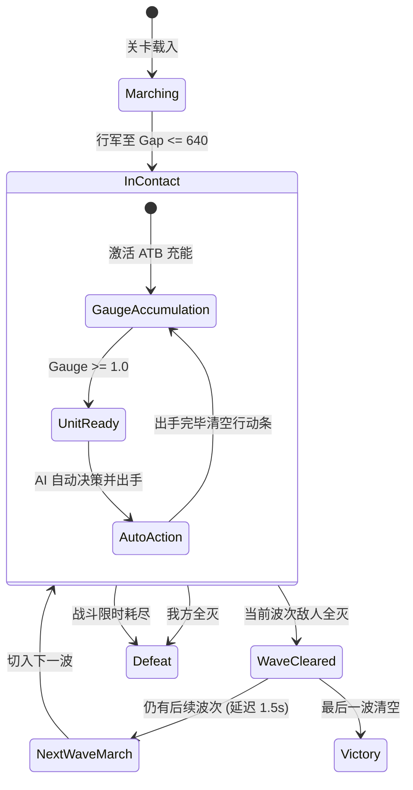

# 战斗系统核心机制文档

> **文档定位**：**纯战斗规则集**，不含世界观、构筑系统与养成内容。目标是"照此文档可独立实现一个行为一致的战斗内核"。
> **适用范围**：战斗内核实现、数值调优、AI 行为、无头自动化测试。
> **关联文档**：[DESIGN_DECISIONS.md](DESIGN_DECISIONS.md)（决策总账）、[WORLD_SETTING.md](WORLD_SETTING.md)（命名真值源）、[ROGUE_SYSTEM_ARCHITECTURE.md](ROGUE_SYSTEM_ARCHITECTURE.md)

### v2.0 变更摘要

依据 [DESIGN_DECISIONS.md](DESIGN_DECISIONS.md)，本版相对 v1.0 有大幅删改：

| 决策 | 影响 |
|:---:|---|
| **D-04** 纯全自动 | 删除拖拽下令、托管窗口、蓄力机制、拖拽目标规则。**战斗期间零玩家输入** |
| **D-08** 职业插槽化 | 删除整个「职业天赋体系」章节。`Class` 字段 → `Tags` 集合。**内核不再认识"职业"与"羁绊"** |
| **D-02** 元素环 | 五行改为中性枚举 `Element`，各世界仅换显示表皮 |
| **D-09** 战损 | 复活机制整节重写 ✅ 已闭环（重伤与跨节点继承） |
| **D-20** 叙事 | 彻底废除运行时 LLM 机制，全面确立纯离线确定性事件契约 |

### 标注约定

| 标记 | 含义 |
|:---:|---|
| *（无标记）* | 既定规则 |
| **[补全]** | 实现时必须有明确答案的行为，本版给出默认口径 |
| **[推导]** | 由既有规则计算得出的参考数据 |
| ✅ | **已决策定案**，规格闭环，见 [DESIGN_DECISIONS.md](DESIGN_DECISIONS.md) |

---

## 目录

**A. 基础模型**
1. [机制总览](#一机制总览)
2. [术语与符号](#二术语与符号)
3. [单位属性模型](#三单位属性模型)
4. [战场空间与阵型规则](#四战场空间与阵型规则)

**B. 时间与流程**

5. [战斗生命周期](#五战斗生命周期)
6. [主循环与固定步长](#六主循环与固定步长)
7. [行动条（ATB）](#七行动条atb)

**C. 出手与结算**

8. [资源系统：法力与怒气](#八资源系统法力与怒气)
9. [出手形态：普攻 / 战技 / 大招](#九出手形态普攻--战技--大招)
10. [目标选取规则](#十目标选取规则)
11. [单次出手完整结算管线](#十一单次出手完整结算管线)
12. [数值与公式](#十二数值与公式)
13. [标签与修正器](#十三标签与修正器)
14. [状态效果体系](#十四状态效果体系)

**D. 系统层**

15. [AI 行为](#十五ai-行为)
16. [波次推进与战损](#十六波次推进与战损)
17. [胜负判定](#十七胜负判定)
18. [确定性与随机数](#十八确定性与随机数)
19. [事件流接口](#十九事件流接口)
20. [常量速查表](#二十常量速查表)

**附录**

- [附录 A：本版补全的规格决策清单](#附录-a本版补全的规格决策清单)
- [附录 B：已知设计风险](#附录-b已知设计风险)
- [附录 C：实现验证清单](#附录-c实现验证清单)

---

# A. 基础模型

## 一、机制总览

战斗为**实时推进、纯全自动**。战斗期间**没有任何玩家输入**——玩家的全部决策前置到战前构筑与布阵。

核心循环由三条规则咬合：

1. **行动条驱动出手顺序**——每个单位按自身速度实时充能行动条，充满即出手；
2. **资源决定出手形态**——怒气满放大招，否则法力满放战技，否则普攻；
3. **AI 决定目标**——玩家无法在战斗中干预，AI 行为质量直接决定体验。

在此之上叠加两层深度：**元素相克**、**多波次连战**。构筑层的羁绊与遗物**不在内核内**，它们在战前被折算为 `Modifier` 注入（见[第十三节](#十三标签与修正器)）。

所有战斗计算为**确定性纯逻辑**，不依赖渲染帧率与表现层，支持无头模式下的极速模拟与单元测试。确定性的保障条件见[第十八节](#十八确定性与随机数)。

---

## 二、术语与符号

| 符号 / 术语 | 含义 |
|---|---|
| `Gauge` | 行动条，`[0, 1]`，达到 `1.0` 即就绪 |
| `Mana` | 法力，`[0, 100]`，满槽触发**战技** |
| `Rage` | 怒气，`[0, 100]`，满槽触发**大招** ✅ D-04b |
| `Atk` / `Armor` / `Speed` | 攻击力 / 护甲 / 速度 |
| `HpRatio` | 当前生命 ÷ 最大生命 |
| `Elem` | 元素克制系数，取 `1.25 / 1.00 / 0.75` |
| `Tags` | 单位身上的标签集合，由插槽装配派生。**内核只读不判义** |
| `SkillMult` | 技能配置表中的伤害/治疗倍率 |
| `SlowFactor` | 减速系数，钳制于 `[0.2, 1.0]` |
| **就绪（Ready）** | `Gauge >= 1.0` 且未被眩晕/冰冻 |
| **出手（Action）** | 一次完整的普攻、战技或大招，正常消耗满行动条 |
| **额外再动（ExtraAction）** | 由 `Modifier` 触发的追加出手，**不产生资源** |
| **直接攻击伤害** | 由普攻、战技或大招造成的伤害。**不含** DOT 跳伤 |

---

## 三、单位属性模型

### 3.1 静态属性（战斗开始时装载，战中不变）

| 字段 | 类型 | 说明 |
|---|---|---|
| `UnitId` | `int` | 战场内唯一自增 ID，**一切排序的最终 tie-break 键** |
| `Side` | `enum{Player, Enemy}` | 阵营 |
| `Tags` | `IReadOnlySet<string>` | **标签集合**，由插槽装配派生。内核只用于 `Modifier` 匹配，不解释其含义 |
| `Element` | `enum{None, Metal, Wood, Water, Fire, Earth}` | 元素属性 |
| `MaxHp` / `Atk` / `Armor` / `Speed` | `int` | 基础属性。`Atk` 同时作为治疗力 |
| `MoveSpeed` | `float` | 行军移速（我方 `900`，敌方 `800`） |
| `ActiveSkill` | `SkillDef?` | **战技**（法力驱动），来自插槽技能类词条，可为空 |
| `UltimateSkill` | `SkillDef?` | **大招**（怒气驱动），素体本命，不可更换，可为空 ✅ D-04b |

> ⛔ **v1.0 的 `Class` 字段已删除**（D-08）。职业是可装卸的插槽被动，对内核而言只是 `Tags` 里的一个字符串。内核中**不得出现任何 `if (Class == X)` 形式的判断**。

### 3.2 动态状态

| 字段 | 初值 | 说明 |
|---|---|---|
| `Hp` | `MaxHp` | `<= 0` 判定阵亡 |
| `Mana` | `0` **[补全]** | 当前法力 |
| `Rage` | `0` **[补全]** | 当前怒气 |
| `Gauge` | `0` | 当前行动条 |
| `IsExtraAction` | `false` | 本次出手是否为额外再动 |
| `Row` / `Column` | 布阵值 | 排（0=前排, 1=后排）/ 列（0–4） |
| `Position` | `StartLine` | 战场坐标，行军阶段推进 |
| `Alive` | `true` | 存活标记 |
| `Statuses` | `[]` | 状态效果列表 |

> ⛔ **v1.0 的 `ReadyElapsed` 与 `PendingCommand` 字段已删除**（D-04）。无玩家指令，就绪即出手，不存在等待窗口。

### 3.3 派生量（实时计算，不缓存）

```
HpRatio      = Hp / MaxHp
SlowFactor   = clamp(Π(1 - Slow_i.Magnitude), 0.2, 1.0)
IsReady      = Gauge >= 1.0 && !HasStatus(Stun) && !HasStatus(Freeze)
CanCastUlt   = Rage >= 100 && UltimateSkill != null && !HasStatus(Silence)
CanCastSkill = Mana >= 100 && ActiveSkill  != null && !HasStatus(Silence)
```

所有攻防乘区（原 `TalentAtk` / `TalentDR`）现由 `Modifier` 提供，见[第十三节](#十三标签与修正器)。

---

## 四、战场空间与阵型规则

```
           【敌方后排 (Slot 5-9)】  y = +760
           【敌方前排 (Slot 0-4)】  y = +280   (EnemyFrontLine)
===================== 接敌对峙线 Gap = 640 =====================
           【我方前排 (Slot 0-4)】  y = -360   (PlayerFrontLine)
           【我方后排 (Slot 5-9)】  y = -840
```

### 4.1 站位参数

| 参数项 | 标识 | 数值 |
|---|---|---|
| 我方前排基准线 | `PlayerFrontLine` | `-360f` |
| 敌方前排基准线 | `EnemyFrontLine` | `+280f` |
| 接敌安全空隙 | `ContactGap` | `640f` |
| 前后排间距 | `RowSpacing` | `480f` |
| 列间距（X 轴） | `ColumnSpacing` | `160f`（5 槽：`-320, -160, 0, +160, +320`） |
| 起始行军线 | `StartLine` | `±1250f` |

### 4.2 布阵约束 ✅ [D-07](DESIGN_DECISIONS.md)

**已定案**：彻底解除布阵约束，释放 2×5 全部 10 格自由站位。
表现层通过将后排卡牌等比缩放至 0.85，并配合 Y 轴与深度层级排序（Z-Index），彻底消除视觉遮挡，将站位博弈（如 4 前排抗压防刺客切后）完整交还给玩家。

### 4.3 队伍规模 ✅ [D-06](DESIGN_DECISIONS.md)

| 概念 | 数值 |
|---|:---:|
| 阵位容器 | 10 格 |
| **我方出战小队** | **固定 5 人** |
| 结算星级评定 | 按存活比例判定（100% / 50%~80% / <50%） |
| 敌方波次单边人数 | 1 ~ 6 人 |

---

# B. 时间与流程

## 五、战斗生命周期



> ⛔ v1.0 的 `WipedWindow`（5 秒抢救窗口）状态已删除，见[第十六节](#十六波次推进与战损)。

### 5.1 行军阶段（Marching）

- 双方开局位于 `y = ±1250f` 的屏幕外；
- 先锋单位以 `MoveSpeed` 对向推进（我方 `900px/s`，敌方 `800px/s`）；
- **行军期间行动条锁定为 0**，不得出手；
- **[补全]** 行军期间**不推进状态计时、不结算 DOT**，战斗计时器**照常累加**；
- **[补全]** 先到位的一方原地等待，不获得先手收益。

### 5.2 接敌阶段（Contact）

- 双方前排间距缩小至 `ContactGap <= 640f` 时判定接敌；
- 移速归零，锁定于阵线坐标；
- 全体单位解锁行动条累加。

**[推导]** 行军耗时：我方 `(1250-360)/900 ≈ 0.99s`，敌方 `(1250-280)/800 ≈ 1.21s`，接敌时点约 `1.21s`。

### 5.3 战斗限时 ✅ [D-04c](DESIGN_DECISIONS.md)

**已定案 `90s`**（v1.0 为 `180s`）。零输入观战对时长极度敏感，目标单场时长：

| 战斗类型 | 目标时长 |
|---|---|
| 普通战斗 | **20 ~ 40 秒** |
| Boss 战 | **45 ~ 75 秒** |
| 硬性上限（超时判负） | **90 秒** |

---

## 六、主循环与固定步长

### 6.1 固定步长要求

`BattleSim` **必须以固定步长推进**，不得直接消费渲染层的可变 `delta`。

```
FixedDeltaTime = 1/60f   // 16.667ms

accumulator += frameDelta * speedMultiplier    // 倍速在此处生效
while (accumulator >= FixedDeltaTime) {
    sim.Step(FixedDeltaTime)
    accumulator -= FixedDeltaTime
}
// 单帧内最多连续 Step 20 次，防止卡顿或高倍速下的追帧雪崩
```

> ⚠ **倍速实现铁律**（✅ [D-04c](DESIGN_DECISIONS.md)）：倍速必须通过**加快 `Step` 调用频次**实现，**严禁放大 `FixedDeltaTime`**。后者会改变浮点累加序列，导致 2× 与 1× 打出不同结果——玩家侧表现为"开了倍速就输了"，极难排查。

### 6.2 每步执行顺序

**顺序不可调换**——它决定了同一 tick 内"DOT 致死"与"该单位出手"的优先级等边界行为。

```
Step(dt):
    ── Phase == Marching ────────────────────────────────
    1. 推进双方队列位置
    2. if 前排间距 <= ContactGap: Phase = InContact; Emit(Contact)
    3. BattleTimer += dt
    return

    ── Phase == InContact ───────────────────────────────
    1. 状态计时推进（全体存活单位，UnitId 升序）
       for s in u.Statuses:
           s.Duration -= dt
           if s.IsDot:
               s.NextTickAt -= dt
               while s.NextTickAt <= 0:
                   结算一跳 DOT（见 12.5）
                   s.NextTickAt += s.TickInterval
           if s.Duration <= 0: 移除并 Emit(StatusExpire)
       // DOT 可致死；本步死亡的单位不再参与后续所有阶段

    2. 行动条推进（全体存活单位，UnitId 升序）
       if HasStatus(Stun) || HasStatus(Freeze): continue    // 冻结
       prev = Gauge
       Gauge = min(1.0, Gauge + Speed * SlowFactor * 0.005 * dt)
       if prev < 1.0 && Gauge >= 1.0: Emit(GaugeFull)

    3. 出手服务（构造就绪队列后遍历）
       ready = 存活 && IsReady 的单位
              .OrderByDescending(Gauge)
              .ThenBy(UnitId)
       for u in ready:
           if !u.Alive: continue          // 可能已在本轮被击杀
           ExecuteAction(u)               // 见第十一节。无等待，就绪即出手

    4. 波次 / 胜负判定
       if 敌方全灭: Phase = WaveCleared; WaveTimer = 1.5f
       if 我方全灭: Phase = Defeat
       BattleTimer += dt
       if BattleTimer > BattleTimeLimit: Phase = Defeat
```

> ⛔ v1.0 阶段 3 中"等待玩家指令"的分支已删除（D-04）。`AutoCommandDelay` 常量一并废除——**这使全局战斗节奏加快约 31%**。

**关键边界行为 [补全]**：

- 同一 tick 内**状态计时先于行动条推进**——DOT 造成的死亡会阻止该单位本 tick 出手；
- 减速在本 tick 内**先衰减、后影响充能**；
- 就绪队列在阶段 3 开始时**一次性构造**，遍历中新就绪的单位等到下一 tick 处理。

---

## 七、行动条（ATB）

### 7.1 充能公式

$$\Delta \text{Gauge} = \text{Speed} \times \text{SlowFactor} \times 0.005 \times \Delta t$$

- 速度 200 的单位 1 秒充满一条；
- `SlowFactor` 多层减速**乘法叠加**后钳制于 `[0.2, 1.0]` **[补全]**；
- **眩晕 / 冰冻期间行动条完全静止，已积累值不清空**——解控后立即就绪 **[补全]**；
- 行动条**封顶于 1.0，溢出丢弃** **[补全]**。

### 7.2 速度—节奏对照表 **[推导]**

$$\text{出手周期} = \frac{200}{\text{Speed}}\ \text{秒}$$

| Speed | 出手周期 | 30s 内出手次数 |
|---:|---:|---:|
| 80 | 2.50s | 12 |
| 100 | 2.00s | 15 |
| 150 | 1.33s | 22.5 |
| 200 | 1.00s | 30 |
| 250 | 0.80s | 37.5 |
| 300 | 0.67s | 45 |

> ⚠ v1.0 的周期含 `+0.6s` 托管延迟，本版已移除。

### 7.3 出手顺序展示（纯观战信息）

表现层可展示接下来若干个即将出手的单位，排序规则同 6.2 阶段 3。

> ⛔ **此展示无任何交互功能**（D-04）。v1.0 的"拖拽卡片下令"整套机制已废除。

---

# C. 出手与结算

## 八、资源系统：法力与怒气

### 8.1 法力（Mana）—— 驱动战技

| 规则 | 值 |
|---|---|
| 取值范围 | `[0, 100]`，溢出丢弃 **[补全]** |
| 战斗开始初值 | `0` **[补全]** |
| 普攻回复 | `+30` |
| 战技消耗 | 归零 |
| 受击退火 | `-10`（见 8.3） |
| 额外再动 | **不回复** |
| 跨波次 | **保留** **[补全]** |

**[推导]** `0 → 30 → 60 → 90 → 100(封顶)`，即**每 4 次普攻后第 5 次出手放战技**。速度 200 时首次战技在第 **4 秒**。

> ⚠ **窗口把控**：✅ [D-04c](DESIGN_DECISIONS.md) 将战斗压到 20~40 秒后，攒满法力的窗口更紧张。若杂兵波次在 4 秒内清场，将有大量单位全程放不出战技。**列为首要验证项**，见[附录 B-7](#b-7-技能系统可能形同虚设)。

### 8.2 怒气（Rage）—— 驱动大招 ✅ [D-04b](DESIGN_DECISIONS.md)

以下为推荐口径。若 D-04b 选择删除怒气系统，本节整节移除。

| 规则 | 值 |
|---|---|
| 取值范围 | `[0, 100]`，溢出丢弃 |
| 战斗开始初值 | `0` |
| 普攻回复 | `+10` |
| 战技回复 | `+20` |
| **受击回复** | **`+5`** ✅ D-04b 定案 |
| 大招消耗 | 归零 |
| 额外再动 | **不回复** |
| 跨波次 | **保留** |

**"受击回怒"的设计意图**：v1.0 中怒气只在出手时产出，承伤单位与输出单位的大招频率完全相同。加入受击回怒后，前排形成"挨打 → 开大"的独立节奏，守护流派获得天然正反馈。

**[推导]** 满怒所需（不含受击回怒）：`4 × 10 + 20 = 60` 每 5 次出手 → `100/60 ≈ 1.67` 循环 ≈ **8.3 次出手**。速度 150 时约 **11 秒**一次大招。

### 8.3 受击法力退火

单位受到**直接攻击伤害**时，法力强制回退 10 点：`Mana = max(0, Mana - 10)`。

**[补全]** 触发边界：

| 伤害来源 | 触发退火 |
|---|:---:|
| 普攻 / 战技 / 大招的直接伤害 | ✅ |
| AOE 命中（**每个被命中目标各触发一次**） | ✅ |
| DOT 跳伤 | ❌ |
| 伤害被减免至保底 1 点 | ✅ |
| 该次伤害导致目标阵亡 | ❌ |

> ⛔ v1.0 的"补系免疫退火"硬判断已删除（D-08）。退火免疫现由 `Modifier` 提供——例如支援羁绊档位可提供"退火减半 / 免疫 / 全队免疫"。

**[推导]** 断蓝阈值——单位速度 `S`，被 `n` 个速度 `Se` 的敌人持续攻击：

$$\text{法力净收入} \ge 0 \iff n \le \frac{3S}{Se}$$

**同速下，4 个及以上敌人攻击同一单位时，该单位法力永远停在 0。** 这对前排影响最大，见[附录 B-3](#b-3-前排单位断蓝)。

---

## 九、出手形态：普攻 / 战技 / 大招

### 9.1 形态判定与优先级

```
优先级：大招 > 战技 > 普攻
```

| 形态 | 条件 | 效果 |
|---|---|---|
| **大招** ✅ D-04b | `Rage >= 100` 且有 `UltimateSkill` 且未沉默 | 按配置结算；`Rage → 0` |
| **战技** | `Mana >= 100` 且有 `ActiveSkill` 且未沉默 | 按配置结算；`Mana → 0`；`Rage +20` |
| **普攻** | 其余全部情况 | `1.0 × Atk` 物理伤害；`Mana +30`；`Rage +10` |

**[补全]** 沉默同时封锁战技与大招，但**不阻止普攻，也不阻止回蓝回怒**。法力/怒气封顶后继续普攻，沉默结束的下一次出手立即释放。因此沉默是"延迟"而非"剥夺"。

### 9.2 ⛔ 已废除的机制（D-04）

| 废除项 | v1.0 出处 |
|---|---|
| 拖拽下令 | 9.1 三种指令来源 |
| 托管等待窗口 `AutoCommandDelay` | 9.2 |
| **蓄力机制**（按住 0.8s → ×1.5） | 9.4 |
| 拖拽目标合法性规则 | 10.3 |
| 手动大招与自动/手动开关 | — |

战斗期间**不存在任何玩家输入接口**。内核不得暴露任何接受指令的公开方法。

---

## 十、目标选取规则

| TargetMode | 阵营 | 选取规则 |
|---|:---:|---|
| `Single` | 敌 | 按 [10.1](#101-默认单体目标规则) 规则 |
| `FrontRow` | 敌 | 敌方前排全部存活单位 |
| `BackRow` | 敌 | 敌方后排全部存活单位 |
| `MiddleColumn` | 敌 | 位于中间列（`Column == 2`）的全部存活敌人 |
| `AllEnemies` | 敌 | 敌方全体存活单位 |
| `RandomN` | 敌 | 从存活敌人中随机抽取 N 个 |
| `LowestHpAlly` | 友 | 我方 `HpRatio` 最低的存活单位 |
| `AllAllies` | 友 | 我方全体存活单位 |

### 10.1 默认单体目标规则 **[补全]**

**距离最近优先**：

```
1. 优先前排（Row == 0）存活单位；前排全灭则取后排
2. 同排内按与攻击者的 |Column 差| 升序
3. 完全并列时按 UnitId 升序
```

该规则使攻击者天然优先打击**正对面的同列单位**，避免全体敌人无脑集火同一个前排单位。

### 10.2 通用选取约束 **[补全]**

- **所有模式一律过滤已阵亡单位**；
- 筛选结果为空时**放弃本次出手，但仍清空行动条并结算资源**（避免空转死循环）；
- `RandomN`：**不重复选取**；存活数 `< N` 时取全部；使用 Fisher–Yates 部分洗牌保证确定性；
- `LowestHpAlly`：按 `HpRatio` 升序，并列取 `UnitId` 最小；**不能选中已阵亡单位**。

> ⛔ v1.0 的 10.3「玩家拖拽的目标合法性」整节已删除（D-04）。

---

## 十一、单次出手完整结算管线

### 11.1 出手主流程

```
ExecuteAction(u):
    isExtra = u.IsExtraAction;  u.IsExtraAction = false

    ── 1. 形态判定（优先级：大招 > 战技 > 普攻）──
    if u.CanCastUlt:        mode = Ultimate; skill = u.UltimateSkill
    elif u.CanCastSkill:    mode = Active;   skill = u.ActiveSkill
    else:                   mode = Basic;    skill = null

    ── 2. 目标解析 ─────────────────────────────
    targetMode = (skill != null) ? skill.TargetMode : Single
    targets = ResolveTargets(u, targetMode)
    if targets.IsEmpty: goto 5           // 空目标：空过但仍结算资源

    ── 3. 逐目标结算（targets 按 UnitId 升序）──
    for t in targets:
        if !t.Alive: continue            // 前序目标的连锁效果可能已击杀
        if 效果为治疗: ApplyHeal(u, t, ...)
        else:          ApplyDamage(u, t, ...)

    ── 4. Modifier 挂钩：出手后附加效果 ─────────
    // 例如「射手」羁绊的普攻附加流血，由 Modifier 在此挂钩实现
    Modifiers.OnAfterAction(u, mode, targets)

    ── 5. 资源结算 ─────────────────────────────
    switch mode:
        Ultimate: u.Rage = 0
        Active:   u.Mana = 0
                  if !isExtra: u.Rage = min(100, u.Rage + 20)
        Basic:    if !isExtra:
                      u.Mana = min(100, u.Mana + 30)
                      u.Rage = min(100, u.Rage + 10)

    ── 6. Modifier 挂钩：额外再动判定 ───────────
    // 内核只提供挂钩点，概率由 Modifier 提供，默认 0
    if u.Alive && Modifiers.RollExtraAction(u, Rng):
        u.Gauge = 1.0
        u.IsExtraAction = true           // 可连锁
        Emit(ExtraAction, u)
    else:
        u.Gauge = 0
```

> ⛔ **v1.0 的第 2 步「蓄力判定」与第 5 步「施法者职业天赋」已删除**（D-04 / D-08）。原先硬编码的"弓系 25% 流血"与"速系 30% 再动"现由 `Modifier` 在第 4、6 步挂钩实现，内核不再知道这些效果的来源。

**[补全]** 关键裁定：

| 情形 | 裁定 |
|---|---|
| 额外再动能否释放战技/大招 | **能**。`isExtra` 只屏蔽资源**产出** |
| 额外再动能否再次触发再动 | **能，可连锁**。概率 `p` 时期望出手 `1/(1-p)` 次 |
| 大招是否消耗法力 | **否**，两条资源轨道互相独立 |
| 目标在遍历中途死亡 | 跳过，不结算 |
| 无合法目标 | 空过，但照常清空行动条并结算资源 |

### 11.2 单目标伤害结算

```
ApplyDamage(src, tgt, skillMult, isAbsolute, statusesToApply):

    ── 1. 攻击侧乘区 ───────────────────────────
    elem   = ElementCoef(src.Element, tgt.Element)        // 1.25 / 1.00 / 0.75
    atkMod = Modifiers.GetAtkMultiplier(src, tgt)         // 羁绊/遗物/世界法则
    raw    = src.Atk * atkMod * skillMult * elem

    ── 2. 防御减免 ─────────────────────────────
    if isAbsolute:
        mitigated = raw                                  // 无视护甲
    else:
        armor     = Modifiers.GetEffectiveArmor(tgt)
        mitigated = raw * (1 - armor / (armor + 1500))

    ── 3. 受伤乘区 ─────────────────────────────
    final = mitigated * Modifiers.GetDamageTakenMultiplier(tgt, src)

    ── 4. 取整与保底 ───────────────────────────[补全]
    final = max(1, (int)floor(final))                    // 仅在此处取整一次

    ── 5. 扣血 ─────────────────────────────────
    tgt.Hp -= final
    Emit(Damage{src, tgt, final, elem})

    ── 6. 受击退火与回怒 ───────────────────────
    if tgt.Hp > 0:
        burn = Modifiers.GetManaBurnAmount(tgt)           // 默认 10，可被减免至 0
        tgt.Mana = max(0, tgt.Mana - burn)
        tgt.Rage = min(100, tgt.Rage + 5)                 // ✅ D-04b 受击回怒

    ── 7. 附加状态 ─────────────────────────────
    if tgt.Hp > 0:
        for s in statusesToApply: ApplyStatus(tgt, s, from: src)

    ── 8. 死亡判定 ─────────────────────────────
    if tgt.Hp <= 0:
        tgt.Hp = 0; tgt.Alive = false
        清空 tgt.Statuses（含全部 DOT）                    // [补全]
        Emit(UnitDeath{tgt})
```

**[补全]** 取整必须在步骤 4 **一次性完成**，中间量保持 `float` 全精度——这是跨平台确定性的必要条件。

### 11.3 治疗结算 **[补全]**

```
ApplyHeal(src, tgt, healMult):
    amount = src.Atk * healMult
           * Modifiers.GetHealingDone(src)        // ✅ D-12
           * Modifiers.GetHealingReceived(tgt)    // ✅ D-12
    amount = max(1, (int)floor(amount))
    actual = min(amount, tgt.MaxHp - tgt.Hp)      // 溢出丢弃
    tgt.Hp += actual
    Emit(Heal{src, tgt, actual, overheal: amount - actual})
```

- 治疗**不受**元素、护甲、受伤乘区影响；
- 治疗**不能**复活已阵亡单位；
- 治疗**不触发**目标的受击退火与回怒。

---

## 十二、数值与公式

### 12.1 元素相克

✅ [D-02](DESIGN_DECISIONS.md)。内核枚举为唯一真值，各世界仅换显示表皮（映射表见 [WORLD_SETTING.md](WORLD_SETTING.md) 第四节）。

```
Fire → Metal → Wood → Earth → Water → Fire
```

| 关系 | `Elem` |
|---|:---:|
| 攻击方克制受击方 | `1.25` |
| 受击方克制攻击方 | `0.75` |
| 无克制 / 任一方 `None` | `1.00` |

**[补全]** 元素系数**仅作用于直接攻击伤害**，不作用于 DOT 与治疗。

**[推导]** 同一对单位互打的伤害比 `1.25 / 0.75 ≈ 1.67`——元素摆幅大于绝大多数单条羁绊效果。

### 12.2 伤害公式

$$\text{Raw} = \text{Atk} \times \text{AtkMod} \times \text{SkillMult} \times \text{Elem}$$

$$\text{Final} = \begin{cases}
\text{Raw} \times \text{DmgTakenMod} & \text{绝对伤害} \\[6pt]
\text{Raw} \times \left(1 - \dfrac{\text{Armor}}{\text{Armor} + 1500}\right) \times \text{DmgTakenMod} & \text{常规伤害}
\end{cases}$$

> ⛔ v1.0 公式中的 `Charge`（蓄力）乘区已删除（D-04）。

### 12.3 护甲收益曲线（K = 1500）

| 护甲值 | 免伤率 | 等效生命倍率 |
|---:|---:|---:|
| 0 | 0.0% | ×1.00 |
| 750 | 33.3% | ×1.50 |
| **1500** | **50.0%** | ×2.00 |
| 3000 | 66.7% | ×3.00 |
| 4500 | 75.0% | ×4.00 |

曲线永不触及 100%。

> ⚠ `K` 为固定常数，不随等级缩放 → [附录 B-6](#b-6-护甲常数不随等级缩放)。
> ⚠ "绝对伤害"是二元开关，对 3000 护甲目标是常规技能的 3 倍 → [附录 B-13](#b-13-绝对伤害是二元开关)。

### 12.4 DOT 跳伤公式 **[补全]**

```
DotDamage = max(1, (int)floor(tgt.MaxHp * pct * DmgTakenMod))
```

| 特性 | 裁定 |
|---|:---:|
| 受护甲影响 | ❌ |
| 受元素影响 | ❌ |
| 受受伤乘区影响 | ✅ |
| 触发退火 / 回怒 | ❌ |
| 可致死 | ✅ |
| 随施法者攻击力成长 | ❌ → [附录 B-8](#b-8-dot-不随成长缩放) |

---

## 十三、标签与修正器

> 本节取代 v1.0 的「六职业天赋体系」（D-08 已整节删除）。

### 13.1 核心原则

**内核不认识"职业"，也不认识"羁绊"。**

单位身上只有一个 `Tags` 字符串集合（由插槽装配派生），以及一份从外部注入的 `Modifiers` 列表。内核**只做两件事**：

1. 在管线的固定挂钩点回调 `Modifiers`；
2. 把 `Tags` 原样提供给 `Modifiers` 用于匹配。

内核中**不得出现任何针对具体标签值的条件判断**。

### 13.2 挂钩点清单

| 挂钩 | 调用位置 | 返回/作用 |
|---|---|---|
| `GetAtkMultiplier(src, tgt)` | 11.2 步骤 1 | 攻击乘区 |
| `GetEffectiveArmor(tgt)` | 11.2 步骤 2 | 有效护甲 |
| `GetDamageTakenMultiplier(tgt, src)` | 11.2 步骤 3 | 受伤乘区 |
| `GetManaBurnAmount(tgt)` | 11.2 步骤 6 | 退火量（默认 10） |
| `GetHealingDone / Received` | 11.3 | 治疗乘区 ✅ D-12 |
| `OnAfterAction(u, mode, targets)` | 11.1 步骤 4 | 出手后附加效果（如附加 DOT） |
| `RollExtraAction(u, rng)` | 11.1 步骤 6 | 额外再动概率（默认 0） |
| `GetManaRegenPerSec(u)` | 6.2 阶段 2 | 法力自然回复 ✅ D-11 |
| `OnBattleStart(units)` | 战斗初始化 | 初始资源、属性修正 |

### 13.3 原六职业天赋的去向

v1.0 中硬编码在内核的六条天赋，现全部由羁绊档位经 `Modifier` 提供 ✅ [D-08a](DESIGN_DECISIONS.md)（详见 [AFFIX_AND_SYNERGY.md](AFFIX_AND_SYNERGY.md)）：

| v1.0 个体天赋 | 现挂钩 |
|---|---|
| 防 25% 免伤 | `GetDamageTakenMultiplier` |
| 近 残血增伤 | `GetAtkMultiplier` |
| 速 30% 再动 | `RollExtraAction` |
| 弓 25% 流血 | `OnAfterAction` |
| 术 蓄力 ×1.5 | **已废除**（D-04），改为战技法力阈值降低 |
| 补 免疫退火 | `GetManaBurnAmount` → 0 |

### 13.4 ⚠ 确定性约束

`Modifier` 的执行必须满足：

1. **排序确定**——多个 `Modifier` 作用于同一挂钩点时，按注入顺序执行，注入顺序由 Rogue 层按确定规则生成；
2. **纯函数**——不得读取未排序集合，不得使用 `BattleRng` 以外的随机源；
3. **乘区可交换**——所有乘法型 `Modifier` 应满足交换律，避免顺序影响结果。

---

## 十四、状态效果体系

### 14.1 状态实例结构

```
StatusEffect {
    Type         : enum{Stun, Freeze, Silence, Slow, Burn, Poison, Bleed}
    Duration     : float
    Magnitude    : float      // 仅 Slow 使用
    TickInterval : float      // DOT 跳伤间隔，非 DOT 为 0
    NextTickAt   : float
    SourceId     : int
}
```

### 14.2 控制类

| 状态 | 枚举 | 行为 | 行动条 |
|:---:|:---:|---|:---:|
| **眩晕** | `Stun` | 无法出手 | 冻结（保留已积累值） |
| **冰冻** | `Freeze` | 无法出手与施法 | 冻结（保留已积累值） |
| **沉默** | `Silence` | 允许普攻与回蓝回怒，禁止战技与大招 | 正常累加 |
| **减速** | `Slow` | 削减移速与行动条累加速率（`Magnitude ≈ 0.30`） | 按 `SlowFactor` 折减 |

### 14.3 持续伤害类（DOT）

| 状态 | 持续 | 间隔 | 每跳 | 总量 |
|:---:|:---:|:---:|:---:|:---:|
| **火烧** `Burn` | 6s | 2s | 5% MaxHp | 15% |
| **中毒** `Poison` | 10s | 2s | 4% MaxHp | 20% |
| **流血** `Bleed` | 6s | 2s | 5% MaxHp | 15% |

> ⚠ **已定案**（✅ D-04c / D-24）：中毒持续时间重定为 10 秒，每 2 秒一跳（共 5 跳），每跳造成 4% 最大生命伤害（总额 20%），与 20~40 秒快节奏战斗完全匹配。

### 14.4 叠加与刷新规则 **[补全]**

**同类型全局唯一**：

```
ApplyStatus(tgt, newStatus):
    existing = tgt.Statuses.Find(s => s.Type == newStatus.Type)
    if existing == null:
        tgt.Statuses.Add(newStatus)
        newStatus.NextTickAt = newStatus.TickInterval    // 不立即跳伤
        Emit(StatusApply)
    else:
        existing.Duration  = max(existing.Duration, newStatus.Duration)
        existing.Magnitude = max(existing.Magnitude, newStatus.Magnitude)
        existing.SourceId  = newStatus.SourceId
        // NextTickAt 不重置——刷新不打断跳伤节奏
```

- 同类型**不叠加层数**，后施加者刷新时长并取较高强度；
- **不同类型**可任意共存。

### 14.5 其他裁定 **[补全]**

| 情形 | 裁定 |
|---|---|
| 施加时是否立即跳一次 DOT | **否**，首跳在 `TickInterval` 后 |
| 眩晕/冰冻期间状态计时是否流逝 | **是** |
| 眩晕/冰冻期间 DOT 是否继续跳 | **是** |
| 单位阵亡时状态处理 | **全部清空** |
| 状态是否跨波次保留 | **否，波次切换时清空** |
| **控制递减（DR）** | **⚠ 当前无 DR，存在永久控制锁链风险** → [附录 B-9](#b-9-控制无递减) |

---

# D. 系统层

## 十五、AI 行为

✅ [D-04d](DESIGN_DECISIONS.md)。**全自动下 AI 质量直接等于游戏质量**——引入战前 Gambit 战术指令系统（每素体 2 槽，条件+动作），详细规则见 [TACTICS.md](TACTICS.md)。未配置战术或条件未满足时回退至以下基线流程：

### 15.1 基线决策流程（当前实现）

```
AiDecide(u):
    // 形态判定已在 ExecuteAction 中完成，AI 只负责目标偏好
    // 技能类：目标由 TargetMode 自动解析
    // 普攻：按 10.1 默认单体目标规则（最近优先）
```

### 15.2 ⚠ 基线 AI 的已知缺陷

| 缺陷 | 后果 |
|---|---|
| 满资源即放，无时机判断 | 大招砸在残血小怪身上 |
| `LowestHpAlly` 无阈值 | 满血时也会放治疗，浪费一次出手 |
| 无 AOE 目标数判断 | 群体技能打单个目标 |
| 无威胁评估 | 不会集火敌方治疗或高威胁单位 |

### 15.3 战前战术指令系统 (Gambit) ✅ [D-04d](DESIGN_DECISIONS.md)

已正式采纳**战前战术指令配置（Gambit 战术指令）**，完整规格见独立文档 [TACTICS.md](TACTICS.md)：
- 战前为每位素体开放 2 个战术指令槽；
- 首发 16 条原子战术指令（涵盖集火斩杀、越顶狙杀、打断吟唱、残血急救等）；
- 执行管线：按【指令槽 1 → 指令槽 2 → 内置默认 AI】自上而下求值，首个真值短路执行。这一机制在维持 100% 战斗全自动的前提下，彻底解决了全自动下 AI 愚蠢决策的痛点。

---

## 十六、波次推进与战损

### 16.1 波次转场

```
1. 击杀当波全部敌方单位 → Emit(WaveClear)
2. 挂起缓冲 1.5 秒
3. 若无后续波次 → Victory
4. 生成下一波次 SpawnWave()
5. 重新执行 行军 → 接敌 流程
```

**[补全]** 转场时我方单位的状态处理：

| 项 | 处理 |
|---|---|
| 生命值 / 法力 / 怒气 | **保留** |
| 行动条 | **清零** |
| 全部状态效果（含 DOT） | **清空** |
| 位置 | 重置回 `StartLine`，重新行军 |
| 已阵亡单位 | **保持阵亡** |

### 16.2 战损模型 ✅ [D-09](DESIGN_DECISIONS.md)

> ⛔ **v1.0 的「5 秒抢救窗口 + 行军包子复活」整套机制已废除**。该机制为单场手操战斗设计，在肉鸽长线结构中不成立（它使 180s 限时形同虚设，且让星级评定可被道具购买）。

**落地口径（方案 B）**：

| 项 | 规则 |
|---|---|
| 战斗内阵亡 | 单位进入**重伤**状态，本局内不可上阵 |
| 血量 | **跨节点继承**，不自动回满 |
| 救治 | 在营地/商店消耗**信用点**，费用随该素体累计重伤次数递增 |
| 词条 | ✅ [D-09a](DESIGN_DECISIONS.md) **不锁定**，可拔下转给替补 |
| 局内失败 | 可上阵素体不足 5 人且无力救治 |

**内核职责边界**：内核**只负责报告单场战斗的终态**（各单位剩余 HP、是否阵亡），重伤状态、救治、跨节点继承全部由 Rogue 层管理。

---

## 十七、胜负判定

### 17.1 胜利

清空最后一波敌人即胜利，按结算瞬间我方**存活比例**评定星级 ✅ [D-06](DESIGN_DECISIONS.md)：

| 星级 | 条件 |
|:---:|---|
| ★★★ | 全员存活（100%） |
| ★★ | 存活 50% ~ 80% |
| ★ | 存活 < 50% |

> 改用比例而非绝对人数，使将来调整队伍规模时无需再改评定规则。

### 17.2 失败

| 条件 |
|---|
| 我方全灭 |
| 战斗计时器超过 `BattleTimeLimit`（✅ `90s`，[D-04c](DESIGN_DECISIONS.md)） |

**[补全]** 同一 tick 内既满足"敌方全灭"又满足"我方全灭"（AOE 同归于尽）时，**判定为胜利**——玩家侧优先。

---

## 十八、确定性与随机数

### 18.1 随机数

```
class BattleRng {
    // 单一实例，由 BattleSim 持有
    // seed 由 BattleContext.Seed 提供
    uint  NextUInt()
    float NextFloat()            // [0, 1)
    int   Range(int min, int maxExclusive)
}
```

| 约束 | 说明 |
|---|---|
| **单一 RNG 实例** | 整场战斗只有一个随机源 |
| **禁用引擎随机** | 不得使用 `UnityEngine.Random` / `GD.Randf` / `Random.Shared` |
| **调用顺序即状态** | 遍历顺序必须完全确定 |
| **表现层不得消费** | 特效抖动、飘字偏移必须使用独立的表现层 RNG |
| **Modifier 亦受约束** | `Modifier` 内的随机必须走 `BattleRng` |

### 18.2 顺序确定性

| 环节 | 排序键 |
|---|---|
| 状态计时推进 | `UnitId` 升序 |
| 行动条推进 | `UnitId` 升序 |
| 就绪队列服务 | `Gauge` 降序 → `UnitId` 升序 |
| 多目标伤害结算 | `UnitId` 升序 |
| `RandomN` 抽样 | Fisher–Yates，输入集按 `UnitId` 升序 |
| `LowestHpAlly` 并列 | `UnitId` 升序 |
| **`Modifier` 执行** | 注入顺序（由 Rogue 层确定性生成） |
| **`PipelineInterceptor` 执行** | `AuthorityLevel` 降序 → `UnitId` 升序 ✅ D-19 |

### 18.3 浮点确定性

- 固定步长 `1/60f`，禁止消费可变 `delta`；
- **倍速通过加快 `Step` 调用频次实现，严禁放大 `FixedDeltaTime`**；
- 伤害计算中间量保持 `float` 全精度，**仅在最终扣血前取整一次**；
- 禁用 `Math.Pow` / 三角函数等平台实现可能不一致的函数。

### 18.4 可复现性检验

相同 `(seed, 关卡配置, 队伍配置, Modifier 列表)` 必须产出**逐事件完全一致**的事件流。建议作为 CI 回归测试基线。

**倍速一致性测试**：同一 seed 在 1× / 2× / 4× 下必须产出完全相同的事件流。

---

## 十九、事件流接口

内核单向产出事件，表现层单向消费，**表现层不得回写内核状态**。

| 事件 | 载荷 |
|---|---|
| `Contact` | — |
| `GaugeFull` | `unitId` |
| `ExtraAction` | `unitId` |
| `Damage` | `srcId, tgtId, amount, elemCoef, mode` |
| `Heal` | `srcId, tgtId, amount, overheal` |
| `DotTick` | `tgtId, statusType, amount, sourceId` |
| `ManaBurn` | `tgtId, amount` |
| `RageGain` | `unitId, amount, reason` ✅ D-04b |
| `UltimateCast` | `unitId, skillId` ✅ D-04b |
| `StatusApply` / `StatusExpire` | `tgtId, statusType[, duration]` |
| `UnitDeath` | `unitId` |
| `WaveClear` / `WaveStart` | `waveIndex[, isFinalWave]` |
| `BattleEnd` | `result, survivorRatio` |

> ⛔ v1.0 的 `WipedWindowOpen` 与 `UnitRevived` 事件已删除（D-09）。

**[补全]** 事件在内核状态**已变更后**立即入队，同一 `Step()` 内保持产生顺序，表现层在该 `Step()` 返回后统一消费。

---

## 二十、常量速查表

| 类别 | 常量 | 数值 | 状态 |
|---|---|---|:---:|
| **空间** | `PlayerFrontLine` / `EnemyFrontLine` | `-360f` / `+280f` | |
| | `ContactGap` | `640f` | |
| | `RowSpacing` / `ColumnSpacing` | `480f` / `160f` | |
| | `StartLine` | `±1250f` | |
| | 单排上阵上限 | 无限制（释放 2×5 全部 10 格） | ✅ D-07 |
| | 我方队伍人数 | 固定 5 人 | ✅ D-06 |
| **时间** | `FixedDeltaTime` | `1/60f` | |
| | `BattleTimeLimit` | **`90s`**（v1.0 为 180s） | ✅ D-04c |
| | 波次转场缓冲 | `1.5s` | |
| | ~~`AutoCommandDelay`~~ | **已废除** | D-04 |
| **行军** | 我方 / 敌方 `MoveSpeed` | `900` / `800` px/s | |
| **ATB** | `GaugePerSpeedUnit` | `0.005` | |
| | `Gauge` 范围 / 就绪阈值 | `[0, 1]` / `1.0` | |
| | `SlowFactor` 钳制区间 | `[0.2, 1.0]` | |
| **资源** | `Mana` / `Rage` 范围 | `[0, 100]` | |
| | 开局 `Mana` / `Rage` | `0` / `0` | |
| | 战技法力阈值 / 大招怒气阈值 | `100` / `100` | ✅ D-04b |
| | 普攻回法 / 回怒 | `+30` / `+10` | |
| | 战技回怒 | `+20` | |
| | 受击回怒 | `+5` | ✅ D-04b |
| | 受击法力退火 | `-10`（可被 Modifier 减免） | |
| | ~~蓄力时长 / 倍率~~ | **已废除** | D-04 |
| **伤害** | 护甲减免常数 `K` | `K = 800 + 20 × Level`（基线 1500@Lv35） | ✅ D-24 |
| | 伤害保底 / 取整 | `max(1, floor(x))` | |
| | 元素克制 / 被克 | `1.25` / `0.75` | |
| **DOT** | Tick 间隔 | `2s`（首跳延后一个间隔） | |
| | 火烧 / 流血 | 6s，每跳 5% MaxHp | ⚠ 见 14.3 |
| | 中毒 | 20s，每跳 2% MaxHp | ⚠ 可能跑不完 |
| | 叠加规则 | 同类型唯一，取长取强 | |

---

# 附录 A：本版补全的规格决策清单

原 v1.0 共 32 条。D-04 与 D-08 使其中 8 条作废，现存 24 条。

| # | 决策点 | 本版口径 | 影响面 |
|:--:|---|---|:---:|
| ~~1~~ | ~~拖拽期间是否暂停时间~~ | 🗑 D-04 废除 | — |
| ~~2~~ | ~~就绪后多久自动托管~~ | 🗑 D-04 废除 | — |
| ~~3~~ | ~~玩家按住期间是否出手~~ | 🗑 D-04 废除 | — |
| ~~4~~ | ~~蓄力期间行动条是否累积~~ | 🗑 D-04 废除 | — |
| 5 | DOT 叠加规则 | 同类型唯一，取长取强，不重置 tick | 🔴 |
| 6 | DOT 首跳时机 | 施加后 `TickInterval` 才首跳 | 🟡 |
| 7 | DOT 是否触发退火 | 否 | 🟡 |
| 8 | DOT 是否受护甲/元素影响 | 否 | 🟠 |
| 9 | DOT 是否受受伤乘区影响 | 是 | 🟠 |
| 10 | 法力/怒气上限与溢出 | `100`，溢出丢弃 | 🟠 |
| 11 | 开局法力/怒气 | `0` / `0` | 🟠 |
| 12 | 法力/怒气是否跨波保留 | **保留** | 🔴 |
| 13 | 状态是否跨波保留 | **清空** | 🟡 |
| 14 | 行动条是否跨波保留 | **清零** | 🟢 |
| 15 | 出手形态优先级 | 大招 > 战技 > 普攻 | 🔴 |
| 16 | 沉默是否封锁大招 | **是**（与战技一致） | 🟠 |
| 17 | 大招是否消耗法力 | **否**，双轨独立 | 🟠 |
| 18 | 额外再动能否放技能 | 能 | 🟠 |
| 19 | 额外再动能否连锁 | 能 | 🟠 |
| 20 | 减速叠加方式 | 乘法叠加后钳制 | 🟢 |
| 21 | `Single` 回退目标定义 | 最近优先（前排 → 列距 → UnitId） | 🔴 |
| 22 | `RandomN` 是否可重复 | 不重复；不足则取全部 | 🟡 |
| 23 | 无合法目标时的处理 | 空过，但仍清条并结算资源 | 🟡 |
| 24 | 治疗公式 | `Atk × HealMult × 治疗乘区` | 🔴 |
| ~~25~~ | ~~玩家能否拖拽指定治疗目标~~ | 🗑 D-04 废除 | — |
| ~~26~~ | ~~敌方 AI 是否蓄力~~ | 🗑 D-04 废除 | — |
| 27 | AI 是否留资源等时机 | 默认满即放（✅ D-04d 战术系统支持条件保留） | 🟡 |
| 28 | 伤害取整与保底 | `max(1, floor(x))`，仅取整一次 | 🟠 |
| 29 | 单位阵亡时状态处理 | 全部清空 | 🟢 |
| 30 | 胜负同 tick 判定 | 玩家侧优先判胜 | 🟢 |
| 31 | 倍速实现方式 | 加快 Step 频次，不改 `FixedDeltaTime` | 🔴 |
| 32 | `Modifier` 执行顺序 | 注入顺序，由 Rogue 层确定性生成 | 🔴 |

---

# 附录 B：已知设计风险

| 编号 | 风险 | 状态 |
|:---:|---|---|
| **B-1** | ~~手操带宽超载~~ | ✅ D-04=A 彻底解决（零输入） |
| **B-2** | ~~蓄力 DPS 负收益~~ | ✅ 蓄力机制已废除 |
| **B-5** | ~~怒气悬空~~ | ✅ D-04b 重新定性为大招资源（怒气满自动释放本命大招） |
| **B-11** | ~~复活削弱难度信号~~ | ✅ D-09 废除复活机制 |

以下为**仍然存在**的风险：

### B-3 前排单位断蓝

由 8.3 推导，同速下被 4 个及以上敌人攻击的单位法力恒为 0。前排承受攻击最多，结构性地放不出战技。

**现状**：D-08 后退火免疫由 `Modifier` 提供，✅ [D-08a](DESIGN_DECISIONS.md) 的支援羁绊档位（退火减半 → 免疫 → 全队免疫）已把它从"天生被动"变为"构筑决策"，**风险大幅降低但未消除**——不玩支援流派的队伍仍会遇到。

### B-4 阵型决策坍缩

三人排合法列组合唯一（`{0,2,4}`）。成因是渲染遮挡。✅ [D-07](DESIGN_DECISIONS.md) 彻底解除约束，释放全部 10 格，后排 0.85 缩放解决遮挡。

**D-08 后价值上升**：站位不再由职业隐含决定，布阵是玩家仅存的战场表达手段之一。

### B-6 护甲常数不随等级缩放

`K = 1500` 固定 → 低等级护甲近乎废属性，高等级压倒性。建议 `K = 800 + 20 × Level`。

### B-7 技能系统可能形同虚设 ⚠ 风险上升

首次战技需 4 次普攻（速度 200 时 4 秒）。✅ [D-04c](DESIGN_DECISIONS.md) 把战斗压到 20~40 秒后，窗口更紧张。

**必须验证**：无头模拟统计**每场战斗人均战技/大招释放次数**。低于 2 则需调整（降阈值 / 提高回蓝 / 给开局初始资源）。**列为首要验证项。**

### B-8 DOT 不随成长缩放

流血固定"每 2 秒扣最大生命 5%"，满级与 1 级完全相同。抗膨胀是优点，成长无反馈是硬伤。建议混合式 `MaxHp × 3% + Atk × 0.2`。

### B-9 控制无递减

眩晕/冰冻完全冻结行动条，无 DR 或免疫窗口。多个控制单位可永久锁死玩家核心素体。

**全自动下风险加剧**——玩家连"手动打断"这个最后手段都没有，只能眼睁睁看着。**建议必修**：同类控制 DR（100%/50%/25%/免疫，5s 内衰减）。

### B-10 治疗 AI 与残血增伤冲突

`LowestHpAlly` 无阈值释放，会持续优先治疗血量百分比最低的单位——而"突击"流派正是靠低血量吃增伤。建议治疗 AI 对携带 `突击` 标签的单位加权重折扣。

### B-12 速度是复合超级属性

一点速度同时买到：出手频率、法力积累、怒气积累、对敌退火压制、DOT 施加频率——五种收益；一点攻击力只买到一种。

**必须验证**：无头模拟对比"每 1 点速度"与"每 1 点攻击"对 TTK 的边际贡献。

### B-13 绝对伤害是二元开关

对 3000 护甲目标是常规技能的 3 倍。建议改为连续量「无视 X% 护甲」。

### B-14 中毒持续时间超出战斗时长 ⚠ 已修复

中毒持续 20 秒，而 ✅ [D-04c](DESIGN_DECISIONS.md) 目标战斗时长 20~40 秒。**已定案（✅ D-24）**：缩短至 10s / 每跳 4%（共 5 跳总量 20%），解决跳不完的问题。

### B-15 AI 质量成为体验瓶颈 ⚠ 已闭环

D-04 全自动后玩家无法纠正 AI 的任何决策，**AI 质量直接等于游戏质量**。✅ [D-04d](DESIGN_DECISIONS.md) 引入战前 Gambit 战术指令系统（每素体 2 槽），详见 [TACTICS.md](TACTICS.md)。

---

# 附录 C：实现验证清单

内核完成后，用无头模式跑以下基线测试：

| # | 测试项 | 期望 / 关注点 |
|:--:|---|---|
| 1 | 确定性回归 | 相同 seed + 配置 → 逐事件一致 |
| 2 | **倍速一致性** | 1× / 2× / 4× 产出完全相同的事件流 |
| 3 | **人均战技+大招释放次数** | **≥ 2 次/场**，否则见 B-7。**首要验证项** |
| 4 | 单场战斗平均时长 | 目标 20~40 秒，校准 `BattleTimeLimit` |
| 5 | 速度 vs 攻击的边际 TTK 贡献 | 量级应相当，否则见 B-12 |
| 6 | 六羁绊同配对抗胜率矩阵 | 任一流派胜率不应长期 > 65% 或 < 35% |
| 7 | 前排单位场均战技释放次数 | 若接近 0，确认 B-3 |
| 8 | DOT 实际生效比例 | 中毒完整周期完成率，确认 B-14 |
| 9 | 控制链最长持续时间 | 若存在 > 8s 连续失控，确认 B-9 |
| 10 | 元素克制对胜率的影响幅度 | 量化 1.67 摆幅的实际权重 |
| 11 | **AI 决策质量抽查** | 大招是否被浪费在残血目标、AOE 是否只打到 1 人 |
