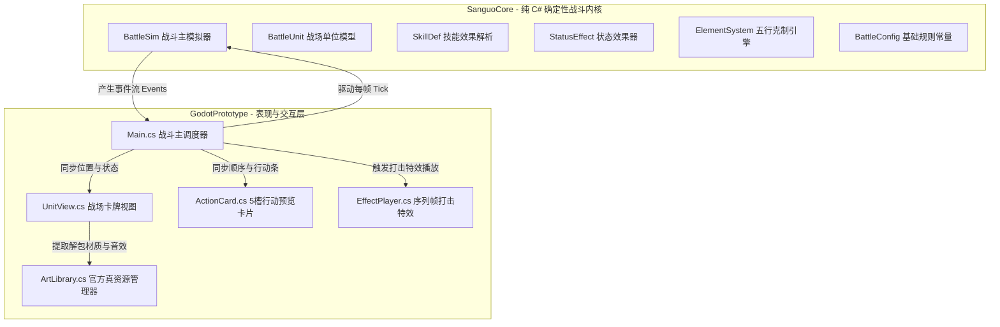
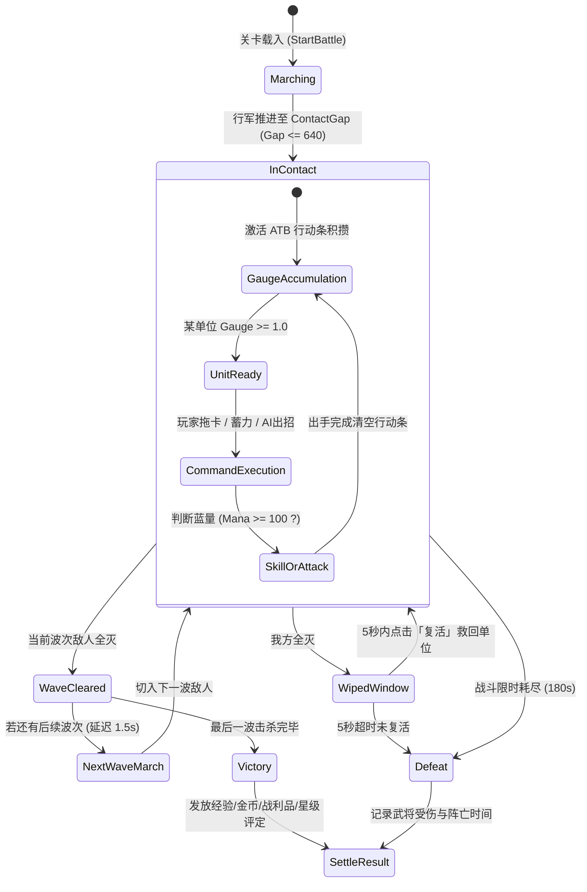
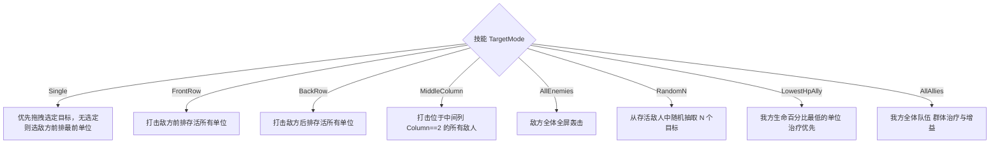

# 《单机三国志2 重制版》核心战斗系统架构与机制设计文档

> # ⛔ 本文档已归档，不再是活跃设计文档
>
> **归档日期**：2026-09-18　**依据**：[DESIGN_DECISIONS.md](DESIGN_DECISIONS.md) D-01（放弃三国题材）、D-03（美术资源基线）
>
> ## 现在应该看哪一份
> | 你想找 | 去看 |
> |---|---|
> | 当前战斗规则 | [BATTLE_CORE.md](BATTLE_CORE.md) |
> | 世界观与命名 | [WORLD_SETTING.md](WORLD_SETTING.md) |
> | 所有设计决策 | [DESIGN_DECISIONS.md](DESIGN_DECISIONS.md) |
>
> ## 本文档的**唯一**保留价值：数值基线
> 下列逆向数据**与题材无关，仍然有效**，是一条已被商业产品验证过的配平曲线，应作为新系统的数值参照：
>
> | 数据 | 用途 |
> |---|---|
> | 86 武将属性表 | 素体属性底盘模板 |
> | 200 技能配置 | 倍率 / 目标模式 / 状态组合的配平样本 |
> | 3968 怪物 + 3545 波次 | 波次强度曲线与遭遇密度参考 |
> | 304 装备 | 词条数值骨架 |
>
> ## 已失效的内容（勿参照）
> - **全部三国角色、剧情、命名**——题材已更换为多元宇宙无限流
> - **全部美术资源规格**（1112 立绘 / 115 背景）——三国绑定，不可复用；打击特效约 30%、音效约 40% 可留
> - **拖拽下令、蓄力施法**——战斗已改为纯全自动零输入（D-04）
> - **六职业个体天赋体系**——职业已下沉为可装卸的插槽被动（D-08）

---

> **版本**：v1.0 (Godot 4.7 原型 / SanguoCore 内核)  
> **核心特性**：实时推进、速度行动条（ATB）、拖拽下令、蓄力施法、六职业天赋体系、五行克制、波次转场、战斗间复活  
> **数据基石**：全量逆向官方 APK 配置表（86 武将 / 200 技能 / 3968 怪物 / 3545 波次 / 304 装备）  
> **视听规格**：全套解包真实资源（1112 立绘 / 115 战斗背景 / 2045 帧武器打击特效 / 110 真实音效）

---

## 目录
1. [系统总体架构与设计原则](#一系统总体架构与设计原则)
2. [战场空间与阵型规格](#二战场空间与阵型规格)
3. [战斗生命周期与流程推进](#三战斗生命周期与流程推进)
4. [核心循环：行动条（ATB）与指令交互](#四核心循环行动条atb与指令交互)
5. [技能、蓄力与目标寻敌机制](#五技能蓄力与目标寻敌机制)
6. [六职业天赋体系与被动机制](#六六职业天赋体系与被动机制)
7. [数值计算与公式引擎](#七数值计算与公式引擎)
8. [状态效果与控制体系 (Buff/Debuff/DOT)](#八状态效果与控制体系-buffdebuffdot)
9. [多波次推进与战斗间复活](#九多波次推进与战斗间复活)
10. [视听打击反馈与表现层实现](#十视听打击反馈与表现层实现)
11. [战后结算、掉落与伤损衰退](#十一战后结算掉落与伤损衰退)

---

## 一、系统总体架构与设计原则



### 1.1 核心分层隔离原则
- **逻辑内核层 (`SanguoCore/Battle/BattleSim.cs`)**：
  - 零 Godot 引擎依赖，纯 C# 确定性计算；
  - 包含完整的站位推进、行动条增量、伤害与五行减免、状态轮询、波次推进及 AI 托管；
  - 支持**无头模式（Headless）**极速自检与单元测试（单场战斗模拟仅需数毫秒）。
- **表现驱动层 (`GodotPrototype/Main.cs`)**：
  - 单向接收 `BattleSim.Events` 事件流（`Damage`、`Heal`、`StatusApply`、`WaveStart`、`GaugeFull` 等）；
  - 驱动飘字（FloatingText）、武器专属打击序列帧（EffectPlayer）、音效混音池（AudioStreamPlayer Pool）以及相机视差背景切换。

---

## 二、战场空间与阵型规格

战场采用纵向大纵深布局，双方阵型取自官方 APK 控件树逆向数据（`2 排 × 5 列 = 10 格阵位`）。

```
           【敌方后排 (Slot 5-9)】  y = +760
           【敌方前排 (Slot 0-4)】  y = +280  (EnemyFrontLine)
===================== 接敌对峙线 间距 Gap = 640 =====================
           【我方前排 (Slot 0-4)】  y = -360  (PlayerFrontLine)
           【我方后排 (Slot 5-9)】  y = -840
```

### 2.1 阵型与站位参数 (`BattleConfig`)

| 参数项 | 内部数值 | 对应像素/单位 | 设计意义与官方出处 |
|---|---|---|---|
| **我方前排基准线** | `PlayerFrontLine` | `-360f` | 锚点 `y = -600` + 前排偏移 `+240` |
| **敌方前排基准线** | `EnemyFrontLine` | `+280f` | 锚点 `y = +280` + 前排偏移 `0` |
| **接敌安全空隙** | `ContactGap` | `640f` | 原作真实接敌距离，防止双方卡牌重叠 |
| **前后排间距** | `RowSpacing` | `480f` | 前排与后排纵向步长（前排 `+240` / 后排 `-240`） |
| **列间距 (X 轴)** | `ColumnSpacing` | `160f` | 5 个固定横向槽位：`x = -320, -160, 0, +160, +320` |
| **起始行军线** | `StartLine` | `±1250f` | 开局从屏幕外向内行军的初始纵坐标 |

### 2.2 原作卡牌层叠与不相邻列铁律
- **横向手牌式层叠**：单张卡牌本体宽度为 `266px`（预制体 `280 × 0.95`），而列间距为 `160px`。因此**同排相邻卡牌天然重叠 106px**。
- **波次布阵铁律**：全量 3545 个官方波次数据显示：**同一排最多上阵 3 人，且绝不只占用相邻列**，通常采用 `0, 2, 4`（间距 `320px`）或 `0, 4`（间距 `640px`）布阵，确保卡牌互不完全遮挡。

---

## 三、战斗生命周期与流程推进



### 3.1 阶段一：行军切入 (Marching)
- 双方开局各自位于 `y = ±1250f` 的屏幕外位置；
- 领头先锋单位以 `MoveSpeed`（我方约 `900px/s`，敌方约 `800px/s`）向战场中央对向行进；
- **行军阶段双方卡牌行动条锁定为 0，不进行普攻或技能出招**；
- 背景图层显示为地图的「开始」阶段。

### 3.2 阶段二：对阵接敌 (Contact)
- 当双方前排间距缩小至 `ContactGap <= 640f` 时，判定正式接敌；
- 双方移速停止，锁定于阵线坐标（`-360f` 与 `+280f`）；
- 背景图层平滑切换至地图「中间」阶段；
- **所有单位解锁行动条累加逻辑，正式进入 ATB 回合循环**。

---

## 四、核心循环：行动条（ATB）与指令交互

游戏不是单纯的“你一刀我一刀”回合制，而是**基于武将敏捷速度的实时充能行动队列机制**。

### 4.1 行动条充能公式 (`UpdateGauge`)
每个单位在每帧推进时累加充能：

$$\Delta \text{Gauge} = \text{Speed} \times \text{SlowFactor} \times \text{GaugePerSpeedUnit} \times \Delta t$$

- $\text{GaugePerSpeedUnit} = 0.005$（即速度 200 的武将在 1 秒内可充能 $200 \times 0.005 = 1.0$ 满条）；
- $\text{SlowFactor}$：减速惩罚系数，受减速 Buff 影响，被限制在 $[0.2, 1.0]$；
- **眩晕/冰冻状态下行动条完全静止**。

### 4.2 行动预览队列 (ActionCard 槽位)
- 战场右侧常驻 **5 个固定尺寸预览卡槽**（`178 × 124` 像素）；
- 队列按以下优先级排序展示前 5 位单位：
  1. **已就绪（Ready == true）的单位置顶**；
  2. 未就绪单位按行动条进度（$\text{Gauge}$）降序排列，卡面压暗并显示进度百分比；
- **拖拽出招**：玩家按住已就绪卡牌，拖曳至敌方单位身上松手，触发指令下发。

---

## 五、技能、蓄力与目标寻敌机制

### 5.1 普攻与技能判定
- **普通攻击**：
  - 法力未满（$\text{Mana} < 100$）时触发；
  - 造成 $1.0 \times \text{Atk}$ 的物理伤害，并回复自身 $+30$ 法力、$+10$ 怒气；
  - 弓系武将普攻自带 25% 概率附加流血 DOT。
- **战法技能 (ActiveSkill)**：
  - 法力满槽（$\text{Mana} \ge 100$）且未被沉默时自动释放技能；
  - 释放后法力归零，怒气增加 $+20$ 点；
  - 播放专属武将战法合成音效 `e_combine_*`。

### 5.2 术系（法师）按压蓄力机制 (Charge)
- **触发条件**：按住右侧就绪行动卡超过 **0.8 秒** 再拖入敌方阵地；
- **职业专享**：仅术系（`HeroClass.Fa`）武将享有蓄力红利；
- **倍率增幅**：技能效果乘算 **1.5 倍**（包括伤害倍率、百分比斩杀以及治疗量）。

### 5.3 智能寻敌解析模式 (`TargetMode`)
技能从配置表中自动解析对应寻敌规则：



---

## 六、六职业天赋体系与被动机制

六大职业拥有深度的战斗差异化天赋，构成了阵容搭配的核心策略：

| 职业 | 官方定位 | 核心战斗天赋公式/效果 | 机制深度解析 |
|:---:|:---:|---|---|
| **防**<br>`Fang` | 坚盾前锋 | $\text{TalentDamageTakenMultiplier} = 0.75$ | **常驻 25% 免伤**。天生高护甲叠加护甲递减曲线，是抵挡后排穿透的核心屏障。 |
| **近**<br>`Jin` | 狂战勇士 | $\text{Multiplier} = 1.0 + 0.6 \times (1.0 - \text{HpRatio})$ | **血量越低攻击越高**。残血时最高获得 **+60% 攻击力增幅**（越战越勇逆转战局）。 |
| **速**<br>`Su` | 敏捷刺客 | 30% 概率触发 `疾行·再动` | 每次行动结算后，有 **30% 概率重置满行动条立即再次出手**（额外再动不额外产生能量）。 |
| **弓**<br>`Yuan` | 致命游侠 | 25% 概率附加流血 (`Bleed`) | 普攻命中有 **25% 概率触发持续 6 秒流血**（每 2 秒按目标最大生命 5% 扣血）。 |
| **术**<br>`Fa` | 秘术策士 | 蓄力时长 $\ge 0.8\text{s} \to \times 1.5$ | 蓄力释放技能可获得 **150% 爆发倍率**（手动操控精髓，手操与自律体验分水岭）。 |
| **补**<br>`Liao` | 济世医者 | **免除受击法力退火惩罚** | 普通单位受击会退回 10 点法力，而**补系武将受击永不丢法力**，确保绝境稳定开大抬血。 |

---

## 七、数值计算与公式引擎

### 7.1 五行相生相克引擎 (`ElementSystem`)
五行属性（金、木、水、火、土）直接来源于武将符石镶嵌与官方怪物表配置：

$$\text{火} \xrightarrow{\text{克}} \text{金} \xrightarrow{\text{克}} \text{木} \xrightarrow{\text{克}} \text{土} \xrightarrow{\text{克}} \text{水} \xrightarrow{\text{克}} \text{火}$$

- **克制判定**：若攻击方克制受击方，伤害系数 $\text{Elem} = 1.25$（增伤 25%）；
- **被克判定**：若受击方克制攻击方，伤害系数 $\text{Elem} = 0.75$（衰减 25%）；
- 无克制关系或无属性时 $\text{Elem} = 1.00$。

### 7.2 伤害与护甲递减公式 (`Mitigate`)

基础伤害输入：

$$\text{Raw} = \text{Atk} \times \text{TalentAtkMultiplier} \times \text{SkillMultiplier} \times \text{ChargeBonus} \times \text{Elem}$$

防御减免机制：
1. **绝对伤害技能**：直接无视护甲：
   $$\text{Damage} = \text{Raw} \times \text{TalentDamageTakenMultiplier}$$
2. **常规攻击技能**：采用双曲护甲减免曲线（常数 $K = 1500$）：
   $$\text{Mitigation} = \frac{\text{Armor}}{\text{Armor} + 1500}$$
   $$\text{FinalDamage} = \text{Raw} \times (1 - \text{Mitigation}) \times \text{TalentDamageTakenMultiplier}$$
   *(注：当目标拥有 1500 护甲时免伤 50%，拥有 3000 护甲时免伤 66.7%，杜绝数值膨胀秒杀)*。

### 7.3 受击法力退火机制
- 任何非补系单位在受到直接攻击伤害时，**法力槽强制回退 10 点**（$\text{Mana} = \max(0, \text{Mana} - 10)$）；
- 这一机制使得高频连击能有效压制敌方高威胁技能的读条。

---

## 八、状态效果与控制体系 (Buff/Debuff/DOT)

游戏内预置完整的异常状态管理器，支持状态更新、自然衰减与周期 Tick 判定：

| 状态类别 | 枚举名 | 官方视觉特效 | 逻辑行为机制 |
|:---:|:---:|:---:|---|
| **眩晕** | `Stun` | `debuff_xuanyun` | 无法行动，行动条充能完全冻结，阻断出招 |
| **冰冻** | `Freeze` | `buff_shengdun` | 冰封控制，冻结行动条与施法 |
| **沉默** | `Silence` | `buff_chenmo` | 允许普攻，但无法消耗法力释放主动技能 |
| **减速** | `Slow` | `buff_mingzhong` | 削减移速与行动条累加速率（Magnitude 约为 30%） |
| **火烧** | `Burn` | `buff_jihuo` | 持续 6 秒，每 2 秒按最大生命 5% 产生直接伤害 |
| **中毒** | `Poison` | `debuff_zhuangjia` | 持续 20 秒，每 2 秒按最大生命 2% 产生持续侵蚀 |
| **流血** | `Bleed` | `debuff_zhuangjia` | 弓兵专精，持续 6 秒，每 2 秒结算 5% 最大生命 |

---

## 九、多波次推进与战斗间复活

### 9.1 波次转场逻辑
- 击杀当波全部敌方单位后，触发 `WaveClear` 事件；
- 系统挂起缓冲等待 **1.5 秒**；
- 刷新下一波次（`SpawnWave`），重置入场单位位置与行动槽；
- 到达关底波次时，战场背景自适应平滑切换至「关底」画卷。

### 9.2 官方独创机制：战斗间复活武将 (`ReviveUnit`)
- **全灭缓冲窗口**：当我方全员阵亡时，游戏**不会立刻判负结算**，而是进入持续 **5.0 秒** 的生死抢救倒计时；
- **阵亡墓碑交互**：战场上被击败的武将原地化为「墓碑」，上方弹出闪烁的「复活」交互按钮；
- **行军包子消费**：玩家可消耗府库中的**行军包子**（单次复活约 50~150 包子，视等级而定）将武将就地救起；
- **重返战场**：救回的武将以 50% 生命值重聚战力，战斗计时器复位，战局继续推进。

---

## 十、视听打击反馈与表现层实现

为还原纯正手感，所有视听反馈均由数据与武器标签精确驱动：

### 10.1 武器打击特效映射表 (`ArtLibrary.cs`)
根据攻击发起者的 `Weapon` 字段自动查找逆向自官方图集的 150 组序列帧：

```csharp
"sword" / "broadsword"  => "attack_剑_hit" / "attack_斧_hit"
"spear" / "lance"       => "attack_枪_hit"
"halberd"               => "attack_戟_hit"
"bow" / "bow_bullet"    => "attack_弓_hit"
"thunder"               => "attack_闪电_hit"
"ice_bullet"            => "attack_冰锥_hit"
"fire_bullet"           => "attack_火"
```

### 10.2 性能防爆与抖动散布
- **对象池限流**：战场同屏打击特效播放器最大限制为 **12 个**，超出时静默合并，杜绝群体 AOE 造成卡顿掉帧；
- **文字漂移防压盖**：同屏飘出的伤害数字带随机横向抖动（$\pm 34\text{px}$）与向上透明漂移 Tween 缓动。

---

## 十一、战后结算、掉落与伤损衰退

### 11.1 胜负星级裁决
- **3 星评级**：我方 5 人全员存活；
- **2 星评级**：存活 3 ~ 4 人；
- **1 星评级**：存活 1 ~ 2 人。

### 11.2 战后伤损与医馆机制 (`InjurySystem`)
完全继承原作的拟真战争伤损：
- 战斗中阵亡的武将进入 **阵亡** 状态，无法直接参与后续战役；
- 残血结束战斗的武将，按剩余血量比例折算 **重伤疗伤时长**（以真实秒数计时）；
- 玩家需前往【济世医馆】等待时间自愈，或消耗包子瞬间包扎疗伤。

### 11.3 关卡冷却管制
- 通关部分核心关卡后，该关卡进入冷却 CD（如合肥之战冷却 120 秒）；
- 冷却期间限制反复刷取经验，保证数值成长节奏平稳。

---

## 附录：核心源文件速查索引

| 模块名称 | 所在路径 | 核心职责与设计要点 |
|---|---|---|
| **战斗内核** | [`SanguoCore/Battle/BattleSim.cs`](file:///f:/AI/DSH/SanguoRemake/SanguoCore/Battle/BattleSim.cs) | 纯 C# 确定性模拟器、ATB 行动条、伤害计算、五行相克、波次装载、复活机制 |
| **表现主逻辑** | [`GodotPrototype/Main.cs`](file:///f:/AI/DSH/SanguoRemake/GodotPrototype/Main.cs) | Godot 战场调度、事件流消费、拖拽监听、蓄力计时、飘字与音效播放 |
| **美术与音频库** | [`GodotPrototype/ArtLibrary.cs`](file:///f:/AI/DSH/SanguoRemake/GodotPrototype/ArtLibrary.cs) | 官方 APK 真实素材直读索引、背景图层、打击序列帧提取、高清立绘去底 |
| **单位卡牌视图** | [`GodotPrototype/Main.cs` (`UnitView`)](file:///f:/AI/DSH/SanguoRemake/GodotPrototype/Main.cs#L1636) | 战场上每个单位的血条、法力条、就绪光晕、阵亡牌及墓碑交互节点 |
| **行动预览卡片** | [`GodotPrototype/Main.cs` (`ActionCard`)](file:///f:/AI/DSH/SanguoRemake/GodotPrototype/Main.cs#L1966) | 右侧 5 格行动队列槽位、拖卡起点封装、蓄力按住检测 |
| **养成与伤损系统** | [`SanguoCore/Progression/`](file:///f:/AI/DSH/SanguoRemake/SanguoCore/Progression/) | 战后武将受伤衰退、医馆疗伤、等级星级提升与经验金币掉落结算 |
