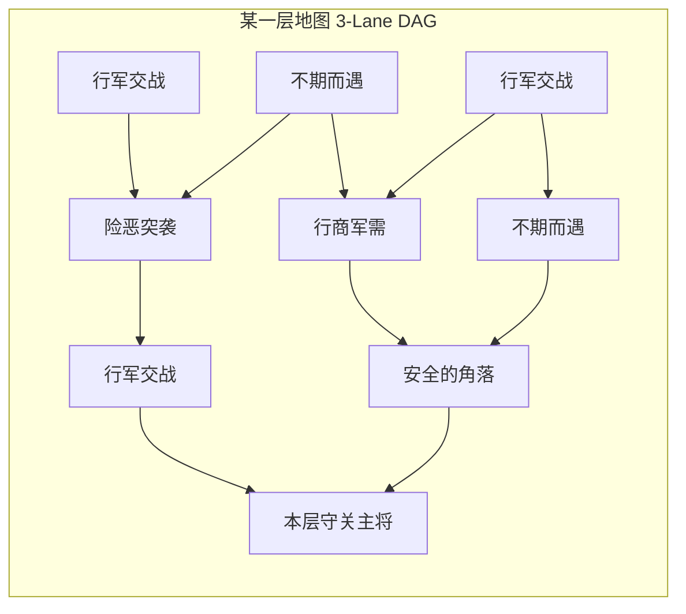
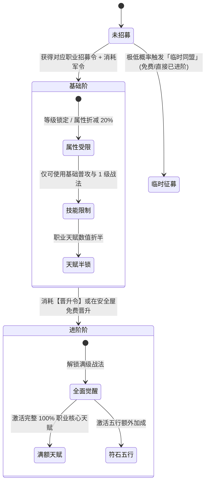

# 《分层三轨地图与方舟式招募构筑机制设计规范》

> **版本**：v1.0 (Rogue Map & Arknights Recruitment Model)  
> **关联文档**：[BATTLE_CORE.md](BATTLE_CORE.md)、[ROGUE_SYSTEM_ARCHITECTURE.md](ROGUE_SYSTEM_ARCHITECTURE.md)  
> **核心参考**：明日方舟《集成战略》（三轨树状路径推进、职业招募令、希望/军令消耗、武将进阶质变）

---

## 目录
1. [系统一：三轨分层地图系统 (Layered 3-Lane Map Engine)](#一系统一三轨分层地图系统-layered-3-lane-map-engine)
2. [系统二：方舟式武将招募与战队系统 (Roster & Recruitment)](#二系统二方舟式武将招募与战队系统-roster--recruitment)
3. [接口契约与数据交互规范](#三接口契约与数据交互规范)
4. [核心待决策设计项记录](#四核心待决策设计项记录)

---

## 一、系统一：三轨分层地图系统 (Layered 3-Lane Map Engine)

### 1.1 拓扑空间模型（数据结构）
单局游戏由若干个 **“层（Floor/Layer）”** 构成（如 1~5 层，最后为终局 Boss 层）。每一层内部是一个**从左至右推进的三轨有向无环图（DAG）**：



### 1.2 三轨约束规则（Three-Lane Rules）
1. **横向三泳道**：固定分为 Lane 0（上路）、Lane 1（中路）、Lane 2（下路）；
2. **纵深步数**：每层通常包含 5 ~ 7 步推进列（Step 0 到 Step N）；
3. **连通性规则**：
   - 玩家当前位于 `(Lane_curr, Step_curr)`；
   - 下一步只能移动到 `Step_curr + 1`，且目标泳道满足：
     $$|\text{Lane}_{\text{next}} - \text{Lane}_{\text{curr}}| \le 1$$
   - 严禁跨两道跳跃（即不允许从 Lane 0 直达 Lane 2）；
4. **终点收敛**：各分叉路径在每层的最后一列强制收敛汇聚至 **守关主将（Boss 节点）**。

### 1.3 节点类型与系统职责映射

| 节点类型 | 对应方舟类型 | 核心行为与结算 | 系统解耦边界 |
|---|---|---|---|
| **行军交战** | 普通作战 | 触发常规战斗波次，产出经验值（提升军阶）、铜币、低阶招募令 | 调用 `BattleSim` 模拟 |
| **险恶突袭** | 紧急作战 | 附加高难词缀/强化精英怪物，产出高额经验、保底高级藏品（遗物）或晋升令 | 装载 `BattleModifier` 词缀后调用 `BattleSim` |
| **不期而遇** | 不期而遇/奇遇 | 文字剧情与多选决策，涉及资源赌博、换取特殊藏品、血量换资源 | **主要由 LLM 驱动动态生成**（带静态配置兜底） |
| **行商军需** | 诡异行商 | 消耗铜币购买藏品、招募令、行军包子，支持付费“刷新货架”与“存钱投资” | 纯 `RogueShop` 状态修改 |
| **安全的角落** | 安全的角落/休整 | 无战斗安全点：三选一（全员回复生命 / 免费晋升 1 名武将 / 获得随机藏品） | 纯 `RogueRoster` 状态修改 |
| **守关主将** | 关底 Boss | 击败本层守军，通往下一层，提供主力招募令与稀有藏品三选一 | 调用 `BattleSim`，触发层跃迁 |

---

## 二、系统二：方舟式武将招募与战队系统 (Roster & Recruitment)

### 2.1 核心经济与指标定义

```
┌────────────────────────────────────────────────────────┐
│ 玩家全局肉鸽面板 (Run Economy)                          │
├──────────────────┬──────────────────┬──────────────────┤
│ 军令 (Hope/希望) │ 军阶 (Command Lv)│ 军粮 (Life/生命) │
│ 用于招募与晋升武将│ 随战斗提升，涨上限│ 漏怪/全灭扣除，0判负│
└──────────────────┴──────────────────┴──────────────────┘
```

* **军令（等同于方舟的“希望 Hope”）**：招募高星武将、进阶晋升武将的核心货币；
* **军阶（等同于方舟的“指挥等级 Command Lv”）**：战斗获胜提供军阶经验，升级时提升“军令上限”与“出战人数上限”；
* **军粮（等同于方舟的“生命值/目标生命 Life Points”）**：关卡失败或漏怪时扣减，归零时单局失败；
* **全队武将库（Roster，上限 10~15 人）** vs **出战阵容（Active Squad，固定 5 人）**：
  * 玩家在局内招募的武将均放入军营库（Roster）；
  * 每次进入战斗前，从军营中挑选 **5 名武将** 放入布阵位。

### 2.2 六大职业招募令与武将池映射

现有的 6 大职业天然对应 6 类职业招募令：

| 招募令名称 | 对应职业 | 招募令包含的武将池与核心战术定位 |
|---|:---:|---|
| **【坚盾招募令】** | **防 (Fang)** | 曹仁、许褚、典韦等（前排抗伤、常驻 25% 减伤、阵型锚点） |
| **【勇烈招募令】** | **近 (Jin)** | 张飞、关羽、太史慈等（狂暴输出、越残血伤害越高） |
| **【神速招募令】** | **速 (Su)** | 赵云、张辽、夏侯渊等（高频刺杀、30% 连续再动、受击压制） |
| **【神射招募令】** | **弓 (Yuan)** | 黄忠、孙尚香、甘宁等（后排物理点杀、普攻百分比流血） |
| **【谋策招募令】** | **术 (Fa)** | 诸葛亮、司马懿、周瑜等（法系爆发、手操蓄力 1.5 倍核弹） |
| **【仁医招募令】** | **补 (Liao)** | 华佗、张仲景、步练师等（全队抬血、免疫法力退火） |

此外包含两种特殊令：
* **【全军征募令】**：可自由在 6 职业中任选一名招募；
* **【进阶晋升令】**：用于将已招募的武将提升为进阶状态。

### 2.3 招募与晋升生命周期（两阶段质变）



---

## 三、接口契约与数据交互规范

### 3.1 地图引擎对外契约（`IRogueMapService`）
```csharp
public interface IRogueMapService
{
    // 生成当前层地图 (确定性种子)
    FloorGraph GenerateFloor(int floorIndex, int seed);
    
    // 获取当前可前进的合法后继节点集合 (泳道差 <= 1)
    IReadOnlyList<MapNode> GetAvailableNextNodes(NodeId currentNodeId);
    
    // 玩家选择走向某个节点
    NodeVisitResult EnterNode(NodeId targetNodeId, RunContext context);
}
```

### 3.2 战队与招募对外契约（`IRosterService`）
```csharp
public interface IRosterService
{
    // 开启招募令：返回按职业与权重过滤出的可选武将三选一
    DraftCandidateOffer OpenRecruitVoucher(VoucherType type, int seed);
    
    // 扣除军令，将武将纳入大名单 (Roster)
    bool ConfirmRecruit(HeroId heroId, bool isFreePromotion = false);
    
    // 晋升武将至完全体
    bool PromoteHero(HeroInstanceId heroInstanceId);
    
    // 战前提取 5 人快照提交给 BattleSim
    BattleTeamSnapshot CreateBattleSnapshot(IReadOnlyList<HeroInstanceId> selectedFive);
    
    // 战后吸收战斗损耗 (扣减血量、标记轻重伤)
    void AbsorbBattleResult(BattleResult battleResult);
}
```

---

## 四、核心待决策设计项记录

### 1. 开局分队选择（Initial Squad Bonus）
* **「虎贲步骑分队」**：开局自带【坚盾】与【勇烈】进阶令，近战武将招募军令消耗 -1；
* **「奇门八阵分队」**：开局自带【谋策】与【仁医】招募令，五行克制倍率提升至 1.4 倍；
* **「军需屯田分队」**：开局军令 +4，行商购买所有物品打 8 折。

### 2. 阵亡机制与血量跨场次继承
* **方案 A（标准方舟式）**：战斗中减员不影响下一场，战后武将满血复活；损耗的是全局【军粮/生命值】（漏怪/全灭扣军粮，军粮归零判负）；
* **方案 B（硬核地牢/原作融合式）**：武将剩余血量跨场次继承，阵亡武将进入重伤假死，需在行商/营地消耗“行军包子”救治，否则后续无法上阵。
