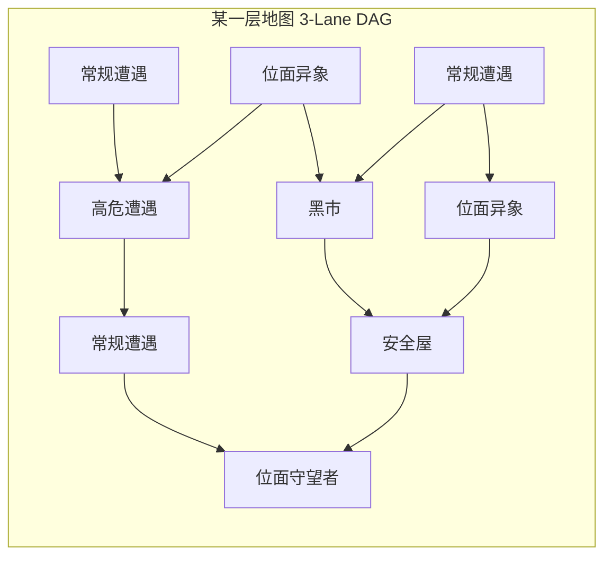
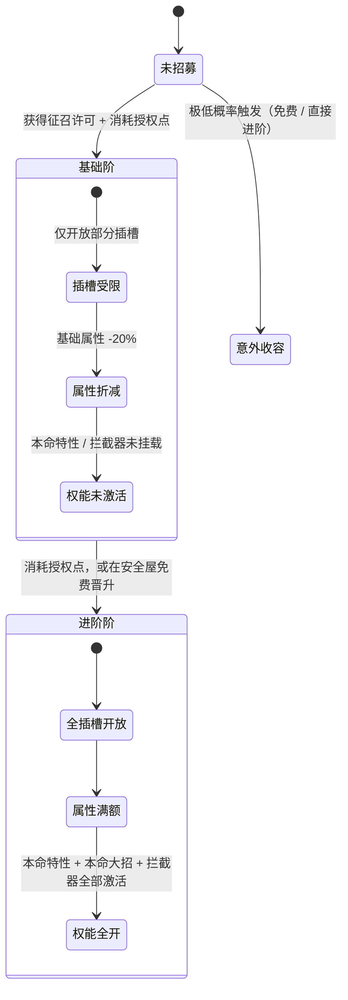

# 分层三轨地图与素体招募构筑机制设计规范

> **版本**：v2.0
> **关联文档**：[DESIGN_DECISIONS.md](DESIGN_DECISIONS.md)（决策总账）、[WORLD_SETTING.md](WORLD_SETTING.md)（命名真值源）、[BATTLE_CORE.md](BATTLE_CORE.md)、[ROGUE_SYSTEM_ARCHITECTURE.md](ROGUE_SYSTEM_ARCHITECTURE.md)
> **结构参考**：《明日方舟·集成战略》的三轨树状路径与节点类型划分（**仅借鉴拓扑结构，题材与经济已全部替换**）

### v2.0 变更摘要

| 决策 | 影响 |
|:---:|---|
| **D-01** 题材改为多元宇宙无限流 | 全部三国角色、经济、节点命名替换 |
| **D-08** 职业插槽化 | **第二节「六职业招募令」整节作废**，素体已无职业，无从按职业筛选 |
| **D-09** 战损模型 | 第四节的 A/B 方案已收敛，见 [D-09](DESIGN_DECISIONS.md) |

### 标注约定

| 标记 | 含义 |
|:---:|---|
| ✅ | 已决策 |
| ⬜ | **依赖未决策项**，当前为推荐口径 |
| 🎨 | 创作提案，措辞待定 |

---

## 目录
1. [三轨分层地图系统](#一三轨分层地图系统)
2. [素体招募与战队构筑](#二素体招募与战队构筑)
3. [词条产出渠道](#三词条产出渠道)
4. [接口契约](#四接口契约)
5. [待决设计项](#五待决设计项)

---

## 一、三轨分层地图系统

> 本节的拓扑结构**与题材无关**，D-01 换题材后完整保留。

### 1.1 拓扑空间模型

单局游戏 = **1 个世界**，内含若干**层（Floor）**。每层是一个从左至右推进的**三轨有向无环图（DAG）**。



### 1.2 三轨约束规则

1. **横向三泳道**：Lane 0（上路）、Lane 1（中路）、Lane 2（下路）；
2. **纵深步数**：每层 5 ~ 7 步推进列；
3. **连通性规则**：玩家位于 `(Lane_curr, Step_curr)`，下一步只能移动到 `Step_curr + 1`，且

   $$|\text{Lane}_{\text{next}} - \text{Lane}_{\text{curr}}| \le 1$$

   严禁跨两道跳跃（不允许 Lane 0 直达 Lane 2）；
4. **终点收敛**：各分叉路径在每层最后一列强制汇聚至 **位面守望者（Boss 节点）**。

### 1.3 单局规模 ⬜ [D-22](DESIGN_DECISIONS.md)

| 项 | 推荐值 |
|---|---|
| 一局 = | **1 个世界** |
| 每局层数 | **3 层**（第 3 层为该世界终局 Boss） |
| 每层步数 | **6 步** |
| 节点总数 | 约 21 个 |
| 目标单局时长 | **35 ~ 50 分钟** |

**[推导]** 参照《杀戮尖塔》约 45~50 节点 / 单局 60~90 分钟。本作单节点耗时更短（战斗全自动，单场 20~40 秒），21 节点约 35~50 分钟，符合移动端单局长度。

### 1.4 节点类型与系统职责 🎨

| 节点类型 | 核心行为与结算 | 系统边界 |
|---|---|---|
| **常规遭遇** | 触发常规战斗波次，产出经验（提升同步率）、信用点、基础词条 | 调用 `BattleSim` |
| **高危遭遇** | 附加高难世界法则 / 强化精英敌人，产出高额经验、保底高阶词条或血脉 | 装载 `Modifier` 后调用 `BattleSim` |
| **位面异象** | 文字剧情与多选决策：资源赌博、以生命换词条、特殊遭遇 | **主要由 LLM 驱动**（静态配置兜底），见 [WORLD_SETTING 第八节](WORLD_SETTING.md) |
| **黑市** | 消耗信用点购买词条、素体、救治重伤；支持付费刷新货架 | 纯 `RogueShop` 状态修改 |
| **安全屋** | 无战斗安全点：三选一（全队疗伤 / 免费晋升 1 名素体 / 随机高阶词条）<br>**兼任词条自由调换点** ⬜ [D-14](DESIGN_DECISIONS.md) | 纯 `RogueRoster` 状态修改 |
| **位面守望者** | 击败本层守军，通往下一层；提供高阶词条或血脉三选一 | 调用 `BattleSim`，触发层跃迁 |

> **安全屋的双重职能**：⬜ [D-09](DESIGN_DECISIONS.md) 推荐血量跨节点继承、⬜ [D-14](DESIGN_DECISIONS.md) 推荐词条仅在营地可调换。两条合力使安全屋同时承担「疗伤 + 重构筑」，节点的战略权重才立得住。

---

## 二、素体招募与战队构筑

### 2.1 局内经济

✅ 命名依据 [WORLD_SETTING 第三节](WORLD_SETTING.md)。

```
┌────────────────────────────────────────────────────────┐
│ 单局经济面板 (Run Economy)                              │
├──────────────────┬──────────────────┬──────────────────┤
│ 授权点 Authority │ 同步率 SyncLevel │ 信用点 Credit    │
│ 招募与晋升素体    │ 涨授权点上限      │ 商店、救治重伤    │
└──────────────────┴──────────────────┴──────────────────┘
```

| 资源 | 作用 | 产出 |
|---|---|---|
| **授权点** | 招募素体、晋升素体 | 战斗奖励、Boss、异象 |
| **同步率** | 战斗胜利积累经验，升级提升**授权点上限** | 战斗 |
| **信用点** | 黑市通用货币、**救治重伤素体** | 战斗、异象、出售词条 |

> ⛔ **已废除**：军令 / 军阶 / 军粮 / 铜币 / 行军包子。
> ⬜ 全局「任务耐久」是否保留见 [D-09b](DESIGN_DECISIONS.md)（**推荐取消**，失败条件统一为"可上阵素体不足"）。

### 2.2 ⛔ 六职业招募令 —— 整节作废

> **D-08 决定：素体无先天职业，职业是可自由装卸的插槽词条。**
>
> v1.0 的六种职业招募令（坚盾/勇烈/神速/神射/谋策/仁医）**在机制上已不可能存在**——招募时素体还没有职业，无从按职业筛选武将池。

### 2.3 素体招募（替代方案）⬜ [D-08d](DESIGN_DECISIONS.md)

招募的筛选维度从「职业」改为「**权能等级**」与「**本命特性类型**」。

| 征召许可类型 | 筛选维度 | 说明 |
|---|---|---|
| **基础征召** | 权能 Level 1~2 | 高频产出，提供前期人手 |
| **进阶征召** | 权能 Level 2~3 | 中频，构筑核心来源 |
| **奇点征召** | 权能 Level 4 | 极低频，仅 Boss / 高危遭遇 / 特殊异象产出 |
| **定向征召** 🎨 | 按本命特性的**正交轴**筛选 | 如「行为状态机类」「词条转译类」，供玩家针对流派补人 |

**招募流程**：开启征召许可 → 按筛选条件从素体池抽出 3 个候选 → 消耗**授权点**确认招募（成本由权能等级决定，见 [HERO_VESSEL 第四节](HERO_VESSEL_SYSTEM_SPEC.md)）。

### 2.4 大名单与出战小队

| 概念 | 规模 | 说明 |
|---|:---:|---|
| **大名单（Roster）** | 10 ~ 15 | 局内已招募的全部素体 |
| **出战小队（Squad）** | **5** ⬜ [D-06](DESIGN_DECISIONS.md) | 每场战斗前从大名单选出 |

> ⚠ **大名单规模与战损惩罚强度直接挂钩**。⬜ [D-09](DESIGN_DECISIONS.md) 下重伤素体本局不可上阵；若大名单过大（15 人），重伤两三个毫无痛感，惩罚失效。建议大名单上限**压到 10**，或采用救治费递增方案施加经济压力。

### 2.5 素体晋升（两阶段质变）



**晋升的具体解锁内容** ⬜ [D-17](DESIGN_DECISIONS.md)——推荐与权能等级**正交**：

| | 基础阶 | 进阶阶 |
|:---:|---|---|
| **Level 1** | 2 通用槽开 1，属性 -20% | 2 槽全开，属性满额 |
| **Level 2** | 专精槽开 1，本命特性未激活 | 槽全开 + 本命特性激活 |
| **Level 3** | 黄金放大槽**锁闭**，转译能力未激活 | 黄金槽开启 + 词条转译激活 |
| **Level 4** | 奇点槽锁闭，管线拦截器**不挂载** | 奇点槽开启 + 拦截器挂载 |

> ⛔ v1.0 的「天赋数值折半」已废除——D-08 后个体职业天赋不存在，折半无从谈起。改为**按插槽与权能逐级解锁**，更符合"品级 = 权能层级而非数值放大"的原始立意。

---

## 三、词条产出渠道

⬜ [D-08d](DESIGN_DECISIONS.md)。职业从"招募筛选维度"变成"掉落物"后，需要新的产出口。

| 词条类别 | 产出频率 | 主要来源 | 设计意图 |
|---|:---:|---|---|
| **职业词条** | **高频** | 常规遭遇奖励三选一中常驻 1 个职业位 | 职业是构筑地基，必须易得且可反复调换，否则玩家被前期运气锁死流派 |
| **技能词条** | 中频 | 黑市主力商品、常规遭遇 | 构筑的填充材料 |
| **血脉词条** | **低频** | Boss、高危遭遇、专属异象 | 流派的上限，应当稀有 |
| **超武词条** | 仅合成 | 安全屋融合两枚满阶跨界词条 | 见 [ROGUE_WORLD 4.3](ROGUE_WORLD_AND_AFFIX_DRAFT.md) |

### 3.1 开局保底 ⬜ [D-08b](DESIGN_DECISIONS.md)

素体无先天职业 → 未装职业词条的素体是只有属性与本命特性的白板。

**推荐**：每名初始素体**预装 1 枚 Lv1 职业词条**，白板素体仍可出战（只是无职业被动）。

理由：若无保底，开局前 10 分钟毫无构筑感；若强制"必须装职业才能上阵"，则词条不足时可能出现"人够但上不了阵"的死锁。

---

## 四、接口契约

### 4.1 地图引擎（`IRogueMapService`）

```csharp
public interface IRogueMapService
{
    // 生成当前层地图 (确定性种子)
    FloorGraph GenerateFloor(int floorIndex, int seed);

    // 获取当前可前进的合法后继节点集合 (泳道差 <= 1)
    IReadOnlyList<MapNode> GetAvailableNextNodes(NodeId currentNodeId);

    // 玩家选择走向某个节点
    NodeVisitResult EnterNode(NodeId targetNodeId, RunContext context);
}
```

### 4.2 战队与招募（`IRosterService`）

```csharp
public interface IRosterService
{
    // 开启征召许可：按权能等级 / 本命特性轴筛选，返回三选一候选
    DraftCandidateOffer OpenRecruitVoucher(VoucherType type, int seed);

    // 扣除授权点，将素体纳入大名单
    bool ConfirmRecruit(VesselId vesselId);

    // 晋升素体至进阶阶
    bool PromoteVessel(VesselInstanceId instanceId);

    // 战后吸收战斗损耗（扣减血量、标记重伤）
    void AbsorbBattleResult(BattleResult battleResult);

    // 救治重伤素体，费用随累计重伤次数递增
    bool TreatVessel(VesselInstanceId instanceId);
}
```

### 4.3 插槽装配（`IInventoryService`）

```csharp
public interface IInventoryService
{
    // 镶嵌词条，严格按 SocketDescriptor 校验标签掩码与槽位类型
    bool EquipAffix(VesselInstanceId vessel, int slotIndex, AffixInstanceId affix);

    // 拆卸词条 —— ⬜ D-14：推荐仅在安全屋 / 黑市节点可用
    bool UnequipAffix(VesselInstanceId vessel, int slotIndex);

    // 精炼：2 枚同名同阶 → 1 枚高阶
    RefineResult Refine(AffixInstanceId a, AffixInstanceId b);

    // 超武融合：两枚满阶跨界词条 → 1 枚概念级超武，并腾出 1 个插槽
    FusionResult Fuse(AffixInstanceId a, AffixInstanceId b);
}
```

### 4.4 羁绊结算（`ISynergyService`）

> ⚠ **羁绊在 Rogue 层结算完毕后才注入内核**（D-08 级联 6）。内核不认识"羁绊"。

```csharp
public interface ISynergyService
{
    // 统计出战小队全部插槽的标签件数
    IReadOnlyDictionary<string, int> CountTags(IReadOnlyList<VesselInstanceId> squad);

    // 匹配羁绊档位 (2)/(4)/(6)，折算为注入内核的修正器列表
    IReadOnlyList<IBattleModifier> ResolveSynergies(IReadOnlyDictionary<string, int> tagCounts);
}
```

**装配 `BattleContext` 的完整链路**：

```
[插槽装配] → CountTags() → ResolveSynergies() → Modifier 列表
                                                     ↓
[遗物] ────────────────────────────────────────→ 合并
[世界法则] ────────────────────────────────────→   ↓
                                          BattleContext.Modifiers
                                                     ↓
                                              BattleSim.Simulate()
```

---

## 五、待决设计项

以下均已移交 [DESIGN_DECISIONS.md](DESIGN_DECISIONS.md) 统一管理，本节仅作索引。

| 项 | 决策编号 | 推荐口径 |
|---|:---:|---|
| 出战人数 | [D-06](DESIGN_DECISIONS.md) | 固定 5 |
| 战损与死亡经济 | [D-09](DESIGN_DECISIONS.md) | 血量跨节点继承 + 重伤救治 |
| 重伤素体的词条是否锁定 | [D-09a](DESIGN_DECISIONS.md) | 不锁定，可拔下转给替补 |
| 是否保留全局任务耐久 | [D-09b](DESIGN_DECISIONS.md) | **取消**，失败 = 可上阵素体不足 |
| 词条装卸自由度 | [D-14](DESIGN_DECISIONS.md) | 仅安全屋 / 黑市可调换 |
| 备用词条背包容量 | [D-16](DESIGN_DECISIONS.md) | 10 格 |
| 权能等级与进阶的关系 | [D-17](DESIGN_DECISIONS.md) | 二者正交 |
| 经济项命名 | [D-18](DESIGN_DECISIONS.md) | 授权点 / 同步率 / 信用点 |
| 单局规模 | [D-22](DESIGN_DECISIONS.md) | 1 世界 × 3 层 × 6 步 |

### 5.1 开局分队选择 🎨 —— 需重新设计

> ⛔ v1.0 的三个开局分队（虎贲步骑 / 奇门八阵 / 军需屯田）**全部作废**：前两个是三国命名（D-01），且「自带某职业进阶令」「某职业招募消耗 -1」的机制依赖已不存在的职业招募体系（D-08）。

**替代方向**（待设计）：开局特色应建立在**新的三个维度**上——

| 维度 | 示例 🎨 |
|---|---|
| **词条倾向** | 开局额外获得 2 枚指定标签的 Lv1 词条 |
| **素体倾向** | 开局大名单多 1 名指定权能等级的素体 |
| **经济倾向** | 开局授权点 +4，黑市全场 8 折 |
